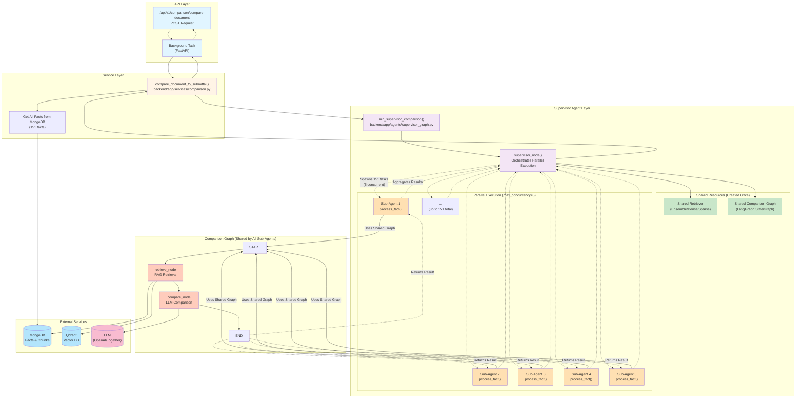
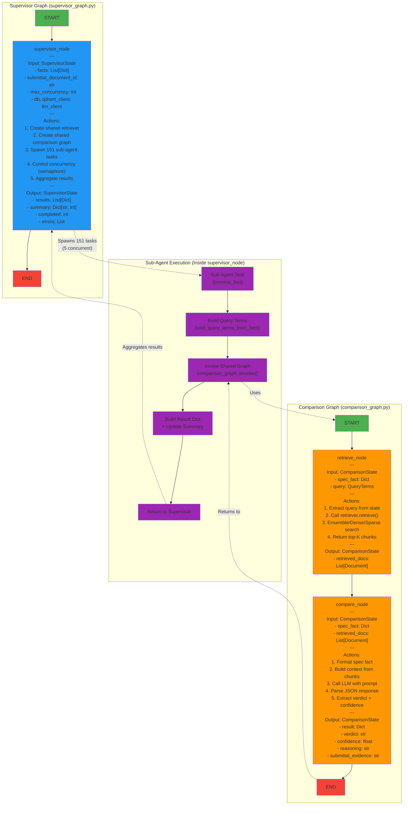
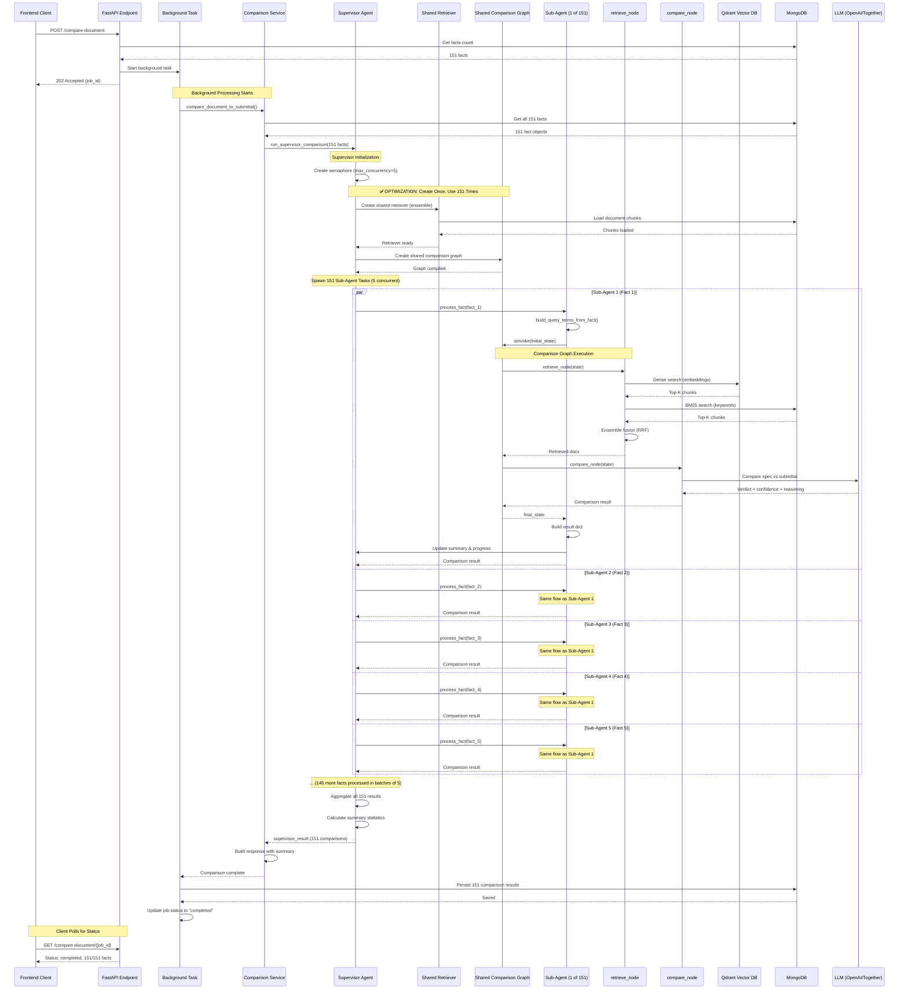

# LangGraph Supervisor Agent Architecture

**Date**: 2025-11-08  
**Status**: ✅ Optimized  
**Commit**: `9b9d952`

---

## 📊 Overview

The Construction Spec Assistant uses a **Supervisor Agent pattern** with LangGraph to enable parallel comparison of specification facts against submittal documents. This architecture provides 3-5x performance improvement over sequential execution.

### Architecture Diagram



> **Note**: Diagram source: [`docs/images/langgraph-supervisor-architecture.mmd`](../docs/images/langgraph-supervisor-architecture.mmd)

---

## 🏗️ Architecture Components

### 1. **Supervisor Graph** (`backend/app/agents/supervisor_graph.py`)

**Purpose**: Orchestrates parallel execution of fact comparisons

**Key Features**:
- Receives all 151 facts at once
- Creates shared retriever and comparison graph (once)
- Spawns 151 sub-agent tasks
- Controls concurrency with semaphore (max 5 concurrent)
- Aggregates results and calculates summary statistics

**State**: `SupervisorState`
```python
{
    "facts": List[Dict[str, Any]],           # Input: 151 facts
    "submittal_document_id": str,            # Target document
    "retrieval_strategy": str,               # "ensemble", "dense", "sparse"
    "top_k": int,                            # Number of chunks to retrieve
    "max_concurrency": int,                  # Concurrency limit (default: 5)
    "db": AsyncIOMotorDatabase,              # MongoDB connection
    "qdrant_client": QdrantClient,           # Qdrant connection
    "llm_client": Union[ChatOpenAI, ChatTogether],  # LLM client
    "results": List[Dict[str, Any]],         # Output: 151 comparison results
    "summary": Dict[str, int],               # Output: {"consistent": X, "inconsistent": Y, "unclear": Z}
    "completed": int,                        # Output: Number of completed comparisons
    "errors": List[Dict[str, Any]],          # Output: List of errors
}
```

**Graph Structure**:
```
START → supervisor_node → END
```

### **State Machines Diagram**



> **Note**: Diagram source: [`docs/images/langgraph-state-machines.mmd`](../docs/images/langgraph-state-machines.mmd)

---

### 2. **Comparison Graph** (`backend/app/agents/comparison_graph.py`)

**Purpose**: Performs RAG retrieval and LLM comparison for a single fact

**Key Features**:
- Shared by all 151 sub-agents (created once, used 151 times)
- Two-node workflow: retrieve → compare
- Returns verdict, confidence, reasoning, and evidence

**State**: `ComparisonState`
```python
{
    "spec_fact": Dict[str, Any],             # Input: Specification fact
    "query": QueryTerms,                     # Input: Dense + sparse query
    "retrieved_docs": List[Document],        # Output from retrieve_node
    "result": Dict[str, Any],                # Output from compare_node
    "error": str,                            # Error message if any
}
```

**Graph Structure**:
```
START → retrieve_node → compare_node → END
```

**Nodes**:
1. **retrieve_node**: RAG retrieval using ensemble/dense/sparse strategy
2. **compare_node**: LLM comparison with structured JSON output

---

### 3. **Sub-Agent Execution** (Inside `supervisor_node`)

**Purpose**: Process a single fact using the shared comparison graph

**Key Features**:
- Runs inside semaphore (max 5 concurrent)
- Builds query terms from fact
- Invokes shared comparison graph
- Updates summary and progress
- Returns comparison result

**Flow**:
```python
async def process_fact(fact: Dict[str, Any], fact_index: int):
    async with semaphore:
        # 1. Build query terms
        query_terms = build_query_terms_from_fact(fact)
        
        # 2. Create initial state
        initial_state = {
            "spec_fact": fact,
            "query": query_terms,
            "retrieved_docs": [],
            "result": {},
            "error": "",
        }
        
        # 3. Invoke shared comparison graph
        final_state = await comparison_graph.ainvoke(initial_state)
        
        # 4. Extract result and update summary
        result = final_state["result"]
        summary[result["verdict"]] += 1
        
        # 5. Return comparison result
        return result
```

---

## 🔄 Execution Flow

### **High-Level Flow**

1. **Frontend** → POST `/api/v1/comparison/compare-document`
2. **API Endpoint** → Start background task, return job_id
3. **Background Task** → Call `compare_document_to_submittal()`
4. **Comparison Service** → Get 151 facts from MongoDB
5. **Comparison Service** → Call `run_supervisor_comparison(151 facts)`
6. **Supervisor Agent** → Create shared retriever and graph (once)
7. **Supervisor Agent** → Spawn 151 sub-agent tasks (5 concurrent)
8. **Sub-Agents** → Use shared graph to compare facts in parallel
9. **Supervisor Agent** → Aggregate 151 results + calculate summary
10. **Comparison Service** → Return results to background task
11. **Background Task** → Persist 151 comparisons to MongoDB
12. **Frontend** → Poll for status, display results

### **Execution Flow Diagram**



> **Note**: Diagram source: [`docs/images/langgraph-execution-flow.mmd`](../docs/images/langgraph-execution-flow.mmd)

### **Detailed Sub-Agent Flow**

For each fact (1 of 151):

1. **Build Query Terms** → `build_query_terms_from_fact(fact)`
   - Dense query: Natural language for embeddings
   - Sparse query: Keywords with must/should/boost

2. **Invoke Comparison Graph** → `comparison_graph.ainvoke(initial_state)`
   - **retrieve_node**:
     - Dense search (Qdrant embeddings)
     - Sparse search (MongoDB BM25)
     - Ensemble fusion (RRF)
     - Return top-K chunks
   - **compare_node**:
     - Format spec fact
     - Build context from chunks
     - Call LLM with comparison prompt
     - Parse JSON response
     - Return verdict + confidence + reasoning

3. **Build Result Dict** → Format comparison result
4. **Update Summary** → Increment verdict count
5. **Update Progress** → Call progress callback
6. **Return to Supervisor** → Aggregate result

---

## ✅ Optimization: Create Once, Use 151 Times

### **Before Optimization** (Commit: `5fb655a`)

**Problem**:
- Each sub-agent called `compare_spec_to_submittal()`
- That function created a NEW retriever and NEW graph for each fact
- For 151 facts: 151 retrievers + 151 graphs = 302 objects
- Log messages: "Creating comparison graph" × 151

**Impact**:
- High memory usage
- Unnecessary object creation overhead
- Log noise (302 messages)

### **After Optimization** (Commit: `9b9d952`)

**Solution**:
- Supervisor creates retriever and graph ONCE before spawning sub-agents
- All 151 sub-agents use the SHARED graph via `graph.ainvoke()`
- For 151 facts: 1 retriever + 1 graph = 2 objects
- Log messages: "Creating comparison graph" × 1

**Benefits**:
- ✅ 99.3% reduction in object creation (302 → 2)
- ✅ 99.3% reduction in log noise (302 → 2 messages)
- ✅ Lower memory usage (single graph instance)
- ✅ Better performance (less overhead)
- ✅ Cleaner code aligned with Supervisor pattern

### **Optimization Comparison Diagram**

```mermaid
graph TB
    subgraph "BEFORE Optimization (Inefficient)"
        B_SUP["Supervisor Node<br/>Receives 151 facts"]

        subgraph "Sub-Agent 1"
            B_SA1["process_fact(fact_1)"]
            B_SA1_CALL["compare_spec_to_submittal()"]
            B_SA1_RET["❌ Create NEW Retriever"]
            B_SA1_GRAPH["❌ Create NEW Graph"]
            B_SA1_EXEC["Execute Graph"]
        end

        subgraph "Sub-Agent 2"
            B_SA2["process_fact(fact_2)"]
            B_SA2_CALL["compare_spec_to_submittal()"]
            B_SA2_RET["❌ Create NEW Retriever"]
            B_SA2_GRAPH["❌ Create NEW Graph"]
            B_SA2_EXEC["Execute Graph"]
        end

        subgraph "Sub-Agent 3-151"
            B_SA3["... (149 more sub-agents)"]
            B_SA3_WASTE["❌ 149 more retrievers<br/>❌ 149 more graphs"]
        end

        B_SUP --> B_SA1
        B_SUP --> B_SA2
        B_SUP --> B_SA3

        B_SA1 --> B_SA1_CALL
        B_SA1_CALL --> B_SA1_RET
        B_SA1_RET --> B_SA1_GRAPH
        B_SA1_GRAPH --> B_SA1_EXEC

        B_SA2 --> B_SA2_CALL
        B_SA2_CALL --> B_SA2_RET
        B_SA2_RET --> B_SA2_GRAPH
        B_SA2_GRAPH --> B_SA2_EXEC

        B_RESULT["Total Objects Created:<br/>151 Retrievers + 151 Graphs = 302<br/>Log Messages: 302"]

        B_SA1_EXEC --> B_RESULT
        B_SA2_EXEC --> B_RESULT
        B_SA3_WASTE --> B_RESULT
    end

    subgraph "AFTER Optimization (Efficient)"
        A_SUP["Supervisor Node<br/>Receives 151 facts"]

        A_SHARED["✅ Create ONCE<br/>---<br/>1 Shared Retriever<br/>1 Shared Comparison Graph"]

        subgraph "Sub-Agent 1"
            A_SA1["process_fact(fact_1)"]
            A_SA1_QUERY["build_query_terms()"]
            A_SA1_INVOKE["✅ Use Shared Graph<br/>graph.ainvoke()"]
        end

        subgraph "Sub-Agent 2"
            A_SA2["process_fact(fact_2)"]
            A_SA2_QUERY["build_query_terms()"]
            A_SA2_INVOKE["✅ Use Shared Graph<br/>graph.ainvoke()"]
        end

        subgraph "Sub-Agent 3-151"
            A_SA3["... (149 more sub-agents)"]
            A_SA3_REUSE["✅ All use same<br/>shared graph"]
        end

        A_SUP --> A_SHARED
        A_SHARED --> A_SA1
        A_SHARED --> A_SA2
        A_SHARED --> A_SA3

        A_SA1 --> A_SA1_QUERY
        A_SA1_QUERY --> A_SA1_INVOKE

        A_SA2 --> A_SA2_QUERY
        A_SA2_QUERY --> A_SA2_INVOKE

        A_RESULT["Total Objects Created:<br/>1 Retriever + 1 Graph = 2<br/>Log Messages: 2<br/>---<br/>99.3% Reduction! 🎉"]

        A_SA1_INVOKE --> A_RESULT
        A_SA2_INVOKE --> A_RESULT
        A_SA3_REUSE --> A_RESULT
    end

    style B_SUP fill:#ffcdd2
    style B_SA1_RET fill:#ef5350
    style B_SA1_GRAPH fill:#ef5350
    style B_SA2_RET fill:#ef5350
    style B_SA2_GRAPH fill:#ef5350
    style B_SA3_WASTE fill:#ef5350
    style B_RESULT fill:#ffcdd2

    style A_SUP fill:#c8e6c9
    style A_SHARED fill:#66bb6a
    style A_SA1_INVOKE fill:#81c784
    style A_SA2_INVOKE fill:#81c784
    style A_SA3_REUSE fill:#81c784
    style A_RESULT fill:#c8e6c9
```



> **Note**: Diagram source: [`docs/images/langgraph-optimization-comparison.mmd`](../docs/images/langgraph-optimization-comparison.mmd)

---

## 📈 Performance Metrics

| Metric | Sequential | Parallel (Before) | Parallel (After) |
|--------|-----------|-------------------|------------------|
| **Execution Time** | 200-500s | 40-100s | 40-100s |
| **Speedup** | 1x | 3-5x | 3-5x |
| **Objects Created** | 151 | 302 | 2 |
| **Memory Usage** | Low | High | Low |
| **Log Messages** | 151 | 302 | 2 |

---

## 🎯 Key Takeaways

1. **Supervisor Pattern**: One supervisor orchestrates many sub-agents
2. **Shared Resources**: Create expensive objects once, reuse many times
3. **Concurrency Control**: Semaphore limits concurrent tasks (max 5)
4. **Parallel Execution**: 151 facts processed in batches of 5
5. **State Machines**: LangGraph provides clean state management
6. **Optimization**: 99.3% reduction in object creation overhead

---

## 📝 Related Files

- `backend/app/agents/supervisor_graph.py` - Supervisor Agent implementation
- `backend/app/agents/comparison_graph.py` - Comparison Graph implementation
- `backend/app/services/comparison.py` - Comparison service layer
- `backend/app/api/v1/comparison.py` - API endpoints
- `backend/app/retrievers/query_builder.py` - Query term builder
- `specs/10-parallel-comparison-optimization.md` - Original specification

---

## 🔗 Related Commits

- `649282a` - Initial Supervisor Agent implementation
- `5fb655a` - Remove pagination from comparison service
- `9b9d952` - Optimize Supervisor Agent (create graph once)
- `3601521` - Add LangGraph Supervisor Agent architecture documentation

---

## 📊 Diagram Files

All diagrams in this document are available as Mermaid source files:

1. **Architecture Overview**: [`docs/images/langgraph-supervisor-architecture.mmd`](../docs/images/langgraph-supervisor-architecture.mmd)
2. **Execution Flow**: [`docs/images/langgraph-execution-flow.mmd`](../docs/images/langgraph-execution-flow.mmd)
3. **State Machines**: [`docs/images/langgraph-state-machines.mmd`](../docs/images/langgraph-state-machines.mmd)
4. **Optimization Comparison**: [`docs/images/langgraph-optimization-comparison.mmd`](../docs/images/langgraph-optimization-comparison.mmd)

These diagrams can be rendered using any Mermaid-compatible viewer (GitHub, VS Code, Mermaid Live Editor, etc.).

