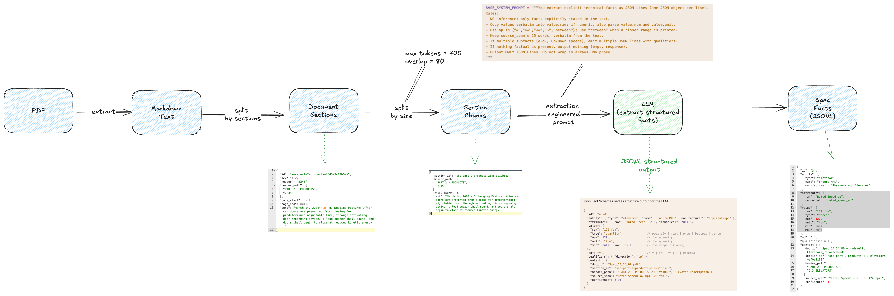
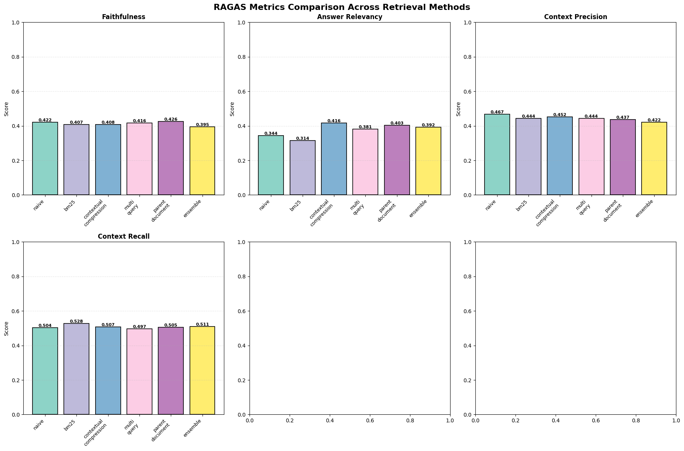

# Certification Challenge Documentation for the **Construction Spec Assistant** project

## 📋 Project Overview
This is an **agentic AI system** designed to help Construction Architects review construction documents and identify inconsistencies between original specifications/drawings and Contractor Submittals.

## 🎯 Task 1: Defining Your Problem and Audience

### Problem Statement
The problem we are trying to solve is to help Construction Architects review complex construction documents and identify inconsistencies between original **specifications/drawings** and **contractor submittals** more effectively with the help of AI.

#### Why This Is a Problem for Our Specific Users (1-2 paragraphs)
Construction Architects are responsible for reviewing construction documents and identifying inconsistencies between original specifications/drawings and contractor submittals. 
**This is a time-consuming and error-prone process that can take many hours or days to complete**, depending on the complexity of the project and the number of documents involved. 
Some Submittals and CAD drawings can contain hundreds of pages and contain complex unstructured information that is difficult to review manually. Usually the Subject Matter Experts (SMEs) (eg. Architects, Engineers, etc.) open multiple PDFs in different screens and try to manually compare them. 

## 🛠️ Task 2: Proposing a Solution

### Solution Statement
Our solution is an agentic AI system that helps Construction Architects review construction documents and identify inconsistencies between original specifications/drawings and contractor submittals more effectively with the help of AI.

The system takes as input from the user the following types of documents.
 - Construction Specifications: following the [CSI standard format](https://www.csiresources.org/standards/overview).
 - Submittals: non standard structure documents created by contractors.
 - Product Descriptions: created by product manufacturers (e.g. elevator brochures, insulation product descriptions, etc.)
 - Architectural CAD Drawings (not yet implemented): technical drawings created by architects using very sophisticated CAD software (e.g. Revit, AutoCAD, etc).

The system then uses sophisticated parsing mechanisms (including OCR) to extract textual information from these documents and then executes a series of steps to prepare the data for comparison. 

* For CSI Specifications, the system:
  1. uses a hierarchical "sectionization" mechanism to extract CSI sections
  2. splits the sections into smaller chunks.
  3. use an LLMs to extract technical facts from them. 

 * For Submittals and Product Descriptions, the system:
  1. splits the text into smaller chunks.
  2. indexes the chunks' embeddings in a vector database for hybrid (semantic and keyword) search.

Next to that, the system implements a Agentic comparison workflow that compares the extracted facts from the CSI Specifications against the relevant sections in the Submittals and Product Descriptions. 

Finally, the system generates a report to the user highlighting the inconsistencies and providing evidence from the original documents to support the findings. The user can then review the report and take appropriate action.

### Technology Stack & Tooling Choices

| Component | Tool/Library | Rationale |
|-----------|--------------|-----------|
| Backend   | FastAPI      | Modern, fast web framework with automatic OpenAPI docs |
|           | Python 3.13  | Latest Python version with performance improvements |
|           | Pydantic     | Data validation and settings management |
|           | uvicorn      | ASGI server |
|           | uv           | Python dependency manager |
|           | Docling      | PDF parsing with OCR support (unstructured.io can also be an option) |
|           | LangChain    | LLM orchestration and chaining |
|           | LangGraph    | State machine for agentic workflows |
|           | LangSmith    | Observability and tracing for LLM workflows |
|           | OpenAI       | GPT-4 family models for fact extraction and comparison |
|           | FastEmbed (`BAAI/bge-small-en-v1.5`) | Embedding model for dense retrieval |
|           | Qdrant       | Vector store for hybrid search |
|           | MongoDB      | Document storage for facts and metadata |
|           | Pint         | Unit normalization and conversion |
| Frontend  | React + TypeScript + Vite | Modern frontend framework with fast dev server |
|           | Tailwind CSS | Utility-first CSS framework for styling |
| Evaluation| RAGAS        | Retrieval performance evaluation framework |

### Agentic Reasoning Implementation

#### Where we use LLMs and Agents
 * **Fact Extraction**: We use an LLM to extract technical facts from the CSI Specifications using a flexible **EAV** JSONL schema (**Entity-Attribute-Value** with evidence).
 * **Comparison**: We use a LangChain agent to orchestrate the comparison workflow. The agent uses a Retrieval-Augmented Generation (RAG) approach to compare the extracted facts from the CSI Specifications against the relevant sections in the Submittals and Product Descriptions.

## 📊 Task 3: Dealing with the Data

### Data Sources
 1. Specifications: 
    - PDF document following the CSI standard format containing technical specifications for a specific product used in a construction project.
    - This document is the source of truth for the technical requirements of a specific product used in the project. From it, we extract the technical facts that we will compare against the submittals.
 2. Submittals and Product Descriptions: 
    - PDFs created by contractors or manufacturers containing product and installation details about the products they are submitting for a specific project.
    - These documents are the target of our comparison. The Agent will compare the technical facts extracted from the specifications against the relevant sections in the submittals.

 > Sample documents can be found in the `data` folder. 

### Chunking strategies

```
┌─────────────────────────────────────┐
│ SPECIFICATION                       │
│   → Notebook-style sectionization   │
│   → CSI-aware chunking              │
│   → Store sections + chunks         │
│   → NO vector indexing              │
├─────────────────────────────────────┤
│ SUBMITTAL / PRODUCT_DESCRIPTION     │
│   → HybridChunker (table-aware)     │
│   → Store chunks only               │
│   → Vector indexing in Qdrant       │
└─────────────────────────────────────┘
```

##### Construction Documentation (PDF)
 * **Specification document**.
   * Strategy: 
     * First pass: Hierarchical sectionization (PART 1/2/3 structure following the CSI standard)
     * Second pass: Chunking within sections aligned to headings/bullets
       * 700 tokens with 10-15% overlap
   * Rationale: Leverage the hierarchical structure of the CSI specifications to extract technical facts. Preserves meaning across headings/paragraphs; overlap improves recall for boundary cases.
 
 The Spec document pass through a multi-step process to extract the technical facts which is better understood using the following diagram:
 
 

 * **Submittals and Product Descriptions**:
   * Strategy: Simple paragraph-based (or sentence-based when the paragraphs are too long) chunking
     * 700 tokens with 10-15% overlap
   * Rationale: No hierarchical structure to preserve. Paragraphs are roughly independent. Overlap helps preserve context recall.

##### 🎯 Benefits of the chunking strategy
1. Table Structure Preservation ✅
 * Tables serialized to Markdown format (not triplet notation)
 * Maintains readability and structure
 * Critical for technical specifications
2. Better Document Hierarchy ✅
 * Respects document structure from Docling
 * Extracts section titles from metadata
 * Better context for retrieval
3. More Granular Chunking ✅
 * Smaller, more focused chunks
 * Better for semantic search
 * Easier for LLMs to process
4. Intelligent Merging ✅
 * `merge_peers=True` combines related sections
 * Reduces fragmentation
 * Maintains semantic coherence

## 🚀 Task 4: Building an End-to-End Agentic RAG Prototype

### Prototype High-Level Architecture

```
┌─────────────────────────────────────────────────────────────┐
│                      FastAPI Application                    │
├─────────────────────────────────────────────────────────────┤
│                                                             │
│  ┌──────────────┐  ┌──────────────┐  ┌──────────────┐       │
│  │   Document   │  │     Fact     │  │  Comparison  │       │
│  │  Processing  │  │  Extraction  │  │    Agent     │       │
│  │   Endpoints  │  │   Endpoints  │  │   Endpoints  │       │
│  └──────┬───────┘  └──────┬───────┘  └──────┬───────┘       │
│         │                 │                 │               │
├─────────┼─────────────────┼─────────────────┼───────────────┤
│         │                 │                 │               │
│  ┌──────▼───────┐  ┌──────▼───────┐  ┌──────▼───────┐       │
│  │   Document   │  │     Fact     │  │  Comparison  │       │
│  │  Processing  │  │  Extraction  │  │    Agent     │       │
│  │   Service    │  │   Service    │  │   Service    │       │
│  └──────┬───────┘  └──────┬───────┘  └──────┬───────┘       │
│         │                 │                 │               │
├─────────┼─────────────────┼─────────────────┼───────────────┤
│         │                 │                 │               │
│  ┌──────▼─────────────────▼─────────────────▼──────────┐    │
│  │              Core Domain Models                     │    │
│  │  (Section, Chunk, Fact, Entity, Attribute, Value)   │    │
│  └─────────────────────────────────────────────────────┘    │
│                                                             │
├─────────────────────────────────────────────────────────────┤
│                                                             │
│  ┌──────────────┐  ┌──────────────┐  ┌──────────────┐       │
│  │   Docling    │  │   LangChain  │  │    Qdrant    │       │
│  │ Integration  │  │  /LangGraph  │  │  VectorStore │       │
│  └──────────────┘  └──────────────┘  └──────────────┘       │
│                                                             │
│  ┌──────────────┐  ┌──────────────┐  ┌──────────────┐       │
│  │   MongoDB    │  │    OpenAI    │  │    Pint      │       │
│  │   Client     │  │     LLM      │  │ Unit Normaliz│       │
│  └──────────────┘  └──────────────┘  └──────────────┘       │
│                                                             │
└─────────────────────────────────────────────────────────────┘
```

### RAG and Agent Architecture

RAG (Retrieval-Augmented Generation) system and LangGraph-based comparison agents for comparing specification facts against submittal documents.

```
┌─────────────────┐
│  Spec Fact      │
└────────┬────────┘
         │
         ▼
┌─────────────────┐
│  Query Builder  │
│  (Dense+Sparse) │
└────────┬────────┘
         │
         ▼
┌─────────────────┐
│  Ensemble       │
│  Retriever      │
└────────┬────────┘
         │
         ▼
┌─────────────────┐
│  LangGraph      │
│  Comparison     │
│  Agent          │
└────────┬────────┘
         │
         ▼
┌─────────────────┐
│  Verdict +      │
│  Evidence       │
└─────────────────┘
```

### API Documentation

Once the server is running, access the interactive API documentation:

- **Swagger UI**: http://localhost:8000/api/v1/docs
- **ReDoc**: http://localhost:8000/api/v1/redoc

### Web UI
 - Web Interface: http://localhost:3000

## 🧪 Task 5: Creating a Golden Test Data Set

### RAGAS Framework Evaluation Results
In order to evaluate the performance of our retrieval system, we used the **RAGAS framework** to compare how different retrieval strategies performs looking at 4 key metrics provided out of the box by the evaluation framework:
 - **Context Precision**: Relevance of retrieved chunks
 - **Context Recall**: Coverage of relevant information
 - **Faithfulness**: Accuracy of generated answers
 - **Answer Relevancy**: Relevance to query

I leveraged a "golden dataset" created on top of the Synthetic Data Set (Q&A) generated by RAGAS during the experimentation phase. Given the nature of the use case, I had to build a balanced Golden Dataset for Submittal/Product Description documents.

It bridges the Synthetic Data Generation (spec-only QA) to our task:
 *	Convert SDG QA → Spec Fact (keep attribute.raw, parse op/num/unit).
 *	Pair each fact with submittal chunk(s) labeled consistent / inconsistent / unclear (from real submittals or synthetics).
 *	Store a gold evidence string (in the submittal) when consistent/inconsistent is determinable.

With that “gold data set” I can evaluate both halves:
 *	Retrieval (from submittals): context precision/recall (RAGAS) vs reference submittal contexts.
 *	Comparison: verdict accuracy and evidence quality.

### Retriever Evaluation Conclusion
Prioritizing context recall, precision, and the nature of the use case using technical factual data leads us to believe that the best retriever is the **Ensemble Retriever** combining the *Parent Document Retriever* and the *BM25 Retriever*.

## Task 6: The Benefits of Advanced Retrieval
The Construction Specification Assistant use case has a peculiarity that imposes a challenge when it comes to retrieval: we are not relying on a human to prompt the system with a query. Instead, we are using a set of technical facts extracted from the specification documents (with the help of an LLM) as the query. This means that the query is **not a natural language query**, but rather a set of technical facts that need to be compared against the submittal documents. From this set of extracted facts, we are leveraging the LangChain **Ensemble Retriever** to retrieve the most relevant chunks from the submittal documents performing a **hybrid search** using *Sparse* (BM25 keyword based) and *Dense* (natural language embeddings) queries.

## Task 7: Assessing Performance

Here are the comprehensive results collected by the evaluation:

📊 RAGAS Metrics Comparison Across Retrievers

```
                                        faithfulness  answer_relevancy  
naive_retrieval_chain                         0.4222            0.3443   
bm25_retrieval_chain                          0.4075            0.3140   
contextual_compression_retrieval_chain        0.4078            0.4160   
multi_query_retrieval_chain                   0.4164            0.3808   
parent_document_retrieval_chain               0.4258            0.4026   
ensemble_retrieval_chain                      0.3954            0.3916   

                                        context_precision  context_recall  
naive_retrieval_chain                              0.4667          0.5039  
bm25_retrieval_chain                               0.4444          0.5277  
contextual_compression_retrieval_chain             0.4519          0.5065  
multi_query_retrieval_chain                        0.4444          0.4967  
parent_document_retrieval_chain                    0.4370          0.5046  
ensemble_retrieval_chain                           0.4222          0.5106  
```

Here is a visual representation of the results:



### Expected Improvements for Second Half of Course

#### Immediate Enhancements (Next 2-4 weeks)
 1. Add support for local models (LLM and embeddings) using Ollama
 2. Enhance the UX/UI
 3. Add support for product descriptions
 4. Add support for visual grounding allowing users to verify the provenance of the information looking at the original PDFs

#### Advanced Features (Next 1-2 months)
 1. Add user authentication 
 2. Add support for WebSocket-based real-time updates
 3. Add support for advanced filtering and search
 4. Add support for dark mode
 5. Add support for parsing CAD drawings and comparing them against the specifications

## 🎥 Final Submission

### GitHub Repository
 * https://github.com/rafaeltuelho/construction-spec-assistant