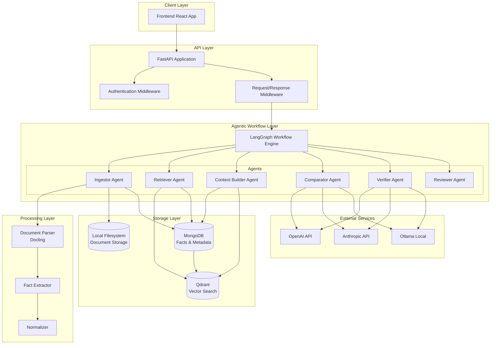

# System Architecture Specification

## Overview

The Architectural Submittal Reviewer is an agentic system designed to help Construction Architects review construction documents and identify inconsistencies between original specifications/drawings and contractor submittals.

## Technology Stack

### Core Backend
- **Python 3.11+** - Primary backend language
- **FastAPI** - Web framework for API endpoints with automatic OpenAPI documentation
- **uv** - Python dependency and virtual environment management
- **Pydantic** - Data validation and serialization

### Document Processing
- **Docling** - Document parsing and extraction from PDFs
- **unstructured** - Alternative document processing option (fallback)

### Data Storage
- **MongoDB** - Primary database for facts store, metadata, and document references
- **Qdrant** (in-memory) - Vector database for semantic search
- **Local Filesystem** - Document storage (initially, with abstraction layer for future migration)

### Agentic Framework
- **LangChain** - LLM integration and prompt management
- **LangGraph** - Agent workflow orchestration and state management

### LLM Integration
- **Multi-provider support**: OpenAI, Anthropic, Ollama
- **Configurable models** per provider
- **Fallback strategies** for provider failures

## System Architecture



## Core Components

### 1. API Layer (FastAPI)
- RESTful endpoints for document upload, processing, and review
- Automatic OpenAPI documentation generation
- Request/response validation using Pydantic models
- Error handling and logging middleware
- CORS configuration for frontend integration

### 2. Document Processing Pipeline
- **Upload Handler**: Accepts PDF files, validates format and size
- **Parser**: Uses Docling to extract text, tables, figures, and structural elements
- **Fact Extractor**: Identifies and normalizes construction specifications
- **Indexer**: Creates searchable indexes in both MongoDB and Qdrant

### 3. Agentic Workflow Engine
- **LangGraph-based orchestration** of the review process
- **State management** for multi-step document comparison
- **Error handling and retry logic** for failed operations
- **Human-in-the-loop** integration for review validation

### 4. Retrieval System
- **Hybrid search** combining semantic (vector) and keyword (BM25) search
- **Context Pack assembly** for efficient LLM usage
- **Metadata filtering** by document type, CSI division, section
- **Citation tracking** with page and span references

### 5. LLM Integration Layer
- **Multi-provider abstraction** supporting OpenAI, Anthropic, and Ollama
- **Prompt engineering** with stable prefixes for KV caching
- **Structured output** enforcement (JSON schemas)
- **Context size optimization** through retrieval and chunking

## Data Flow

### Document Ingestion Flow
1. **Upload**: PDF files uploaded via API endpoint
2. **Parse**: Docling extracts structured content and metadata
3. **Extract Facts**: AI identifies specifications and normalizes values
4. **Index**: Content indexed in both vector and keyword search systems
5. **Store**: Documents stored locally with metadata in MongoDB

### Review Workflow
1. **Query**: User initiates comparison between spec and submittal
2. **Retrieve**: Hybrid search finds relevant passages and facts
3. **Context Build**: Assemble focused context pack for LLM
4. **Compare**: LLM analyzes discrepancies and generates structured output
5. **Verify**: Optional second-pass verification for critical findings
6. **Review**: Human reviewer accepts/rejects findings and provides feedback

## Configuration Management

### Environment Variables
```bash
# Database
MONGODB_URL=mongodb://localhost:27017/construction_specs
QDRANT_URL=http://localhost:6333

# LLM Providers
OPENAI_API_KEY=your_openai_key
ANTHROPIC_API_KEY=your_anthropic_key
DEFAULT_LLM_PROVIDER=openai
DEFAULT_MODEL=gpt-4-turbo

# Storage
DOCUMENT_STORAGE_PATH=/app/data/documents
MAX_FILE_SIZE_MB=100

# Application
API_HOST=0.0.0.0
API_PORT=8000
LOG_LEVEL=INFO
```

### Feature Flags
- `ENABLE_VERIFICATION`: Enable second-pass verification agent
- `ENABLE_HUMAN_REVIEW`: Enable human-in-the-loop validation
- `ENABLE_CACHING`: Enable LLM response caching
- `DEBUG_MODE`: Enable detailed logging and debugging features

## Security Considerations

### Initial Implementation (No Authentication)
- API endpoints accessible without authentication
- Local development and testing focus
- File upload size limits and validation
- Input sanitization for all user-provided data

### Future Security Enhancements
- JWT-based authentication system
- Role-based access control (RBAC)
- API rate limiting and throttling
- Audit logging for compliance
- Data encryption at rest and in transit

## Scalability Considerations

### Horizontal Scaling
- Stateless API design for load balancing
- MongoDB replica sets for read scaling
- Qdrant clustering for vector search scaling
- Document processing queue with worker nodes

### Performance Optimization
- Connection pooling for database connections
- LLM response caching with TTL
- Background processing for document ingestion
- Efficient chunking strategies for large documents

## Monitoring and Observability

### Logging
- Structured logging with correlation IDs
- Request/response logging for API endpoints
- Agent execution tracing and performance metrics
- Error tracking and alerting

### Metrics
- Document processing throughput
- LLM API usage and costs
- Search performance metrics
- User interaction analytics

## Development Workflow

### Local Development
- CLI mode for rapid iteration and debugging
- Hot reloading for API development
- Separate development and production configurations
- Docker Compose for local service orchestration

### Testing Strategy
- Unit tests for individual components
- Integration tests for agent workflows
- API contract testing with OpenAPI specs
- End-to-end tests with sample documents

## Deployment Architecture

### Docker Containers
- Multi-stage builds for optimized images
- Health checks for all services
- Resource limits and scaling policies
- Secrets management with Docker secrets

### Production Considerations
- Container orchestration with Kubernetes
- Persistent volume management
- Backup and disaster recovery procedures
- CI/CD pipeline integration

## Real Document Examples

### Sample Data Structure

The system is designed to process real-world construction documents found in the `data/` folder:

#### 1. Specification Documents
- **File**: `Spec 14 24 00 - Hydraulic Elevators.pdf`
- **Format**: Bluebeam Revu x64, PDF 1.7, 6 pages
- **Structure**: Standard CSI format (Division 14, Section 24 00)
- **Content**: 
  - Part 1: General (administrative, quality, references)
  - Part 2: Products (materials, equipment, specifications)
  - Part 3: Execution (installation, testing, protection)

#### 2. Architectural Drawings
- **File**: `Architectural Drawings.pdf`
- **Format**: PDF 1.4, 8 pages, large format (2160 x 3024 points)
- **Features**:
  - 90-degree page rotation
  - CAD drawings with multiple layers
  - 90+ annotations per page
  - Embedded XObjects (BBA, BBA1, BBA2, etc.)
  - Floor plans with elevator locations
  - Dimensions and callouts

#### 3. Submittal Documents
- **File**: `Submittal and Product Description.pdf`
- **Format**: Binary PDF with manufacturer data
- **Content**:
  - Product specifications
  - Technical data sheets
  - Performance certifications
  - Installation instructions

### Document Processing Requirements

Based on real data analysis, the system must handle:

#### CSI Format Recognition
```
Pattern: ^\d{2}\s\d{2}\s\d{2}$
Examples: "14 24 00", "07 21 00", "03 30 00"
```

#### Specification Section Patterns
```
Part 1: General (administrative, quality, references)
Part 2: Products (materials, equipment, mixes)
Part 3: Execution (preparation, installation, protection)
```

#### Drawing Metadata Patterns
```
- MediaBox dimensions: [0 0 width height]
- Rotation: 0, 90, 180, 270 degrees
- Annotations: Text, callouts, dimensions
- XObjects: Embedded drawings, details, symbols
```

#### Real-World Fact Examples
From Hydraulic Elevator Specification:
```json
{
  "topic": "hydraulic_elevator",
  "attribute": "capacity_lbs",
  "operator": "=",
  "value": 2500,
  "unit": "lbs",
  "source": {
    "pdf": "Spec_14_24_00_Hydraulic_Elevators.pdf",
    "page": 2,
    "span": "Part 2, Section 2.1.A"
  }
}
```

## Integration Points

### Frontend Integration
- RESTful API with JSON responses
- WebSocket support for real-time updates
- File upload with progress tracking
- Error handling and user feedback

### External Service Integration
- LLM provider APIs with retry logic
- Document processing services
- Cloud storage providers (future)
- Authentication providers (future)

## Error Handling Strategy

### Graceful Degradation
- Fallback to alternative LLM providers
- Partial processing for corrupted documents
- Cached responses for known queries
- Manual override for failed automated processes

### Error Recovery
- Automatic retry with exponential backoff
- Circuit breaker patterns for external services
- Dead letter queues for failed processing jobs
- Admin interfaces for error investigation
