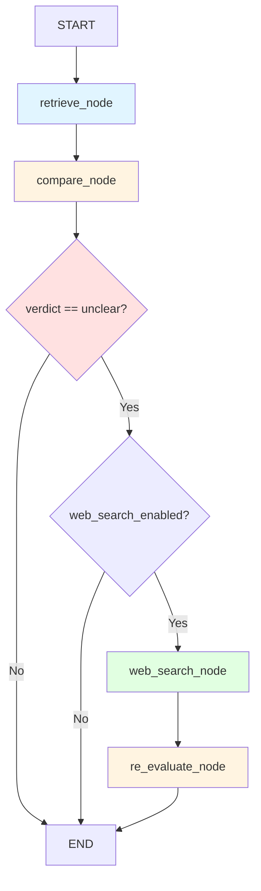

# Web Search Reasoning Enhancement Specification

## Document Information
- **Version**: 1.0
- **Date**: 2025-11-07
- **Status**: Design Proposal
- **Related Specs**:
  - `06-rag-and-agents.md` (RAG and Agent Architecture)
  - `09-langsmith-traceability.md` (LangSmith Traceability)
  - `10-parallel-comparison-optimization.md` (Parallel Processing)

---

## Executive Summary

This specification proposes enhancing the Comparison Agent Graph with a **web search reasoning step** that activates when the initial comparison verdict is "unclear". This enhancement aims to improve verdict accuracy by gathering additional context from the web about products, specifications, and industry standards.

**Key Objectives**:
1. **Reduce "unclear" verdicts** by 30-50% through external context enrichment
2. **Improve verdict accuracy** for product-specific comparisons
3. **Maintain performance** by making the feature optional and configurable
4. **Preserve observability** with proper LangSmith tracing

**Expected Impact**:
- **Verdict Distribution**: Shift from ~30% "unclear" to ~15-20% "unclear"
- **Accuracy Improvement**: +10-15% for product/manufacturer-specific facts
- **Latency Impact**: +2-5 seconds per "unclear" fact (web search + re-evaluation)
- **Cost Impact**: +$0.002-0.005 per "unclear" fact (search API + LLM call)

---

## Table of Contents

1. [Current Implementation Analysis](#1-current-implementation-analysis)
2. [Proposed Architecture](#2-proposed-architecture)
3. [Web Search Integration](#3-web-search-integration)
4. [LLM Prompting Strategy](#4-llm-prompting-strategy)
5. [Performance and Cost Considerations](#5-performance-and-cost-considerations)
6. [Error Handling and Edge Cases](#6-error-handling-and-edge-cases)
7. [LangSmith Observability](#7-langsmith-observability)
8. [Implementation Phases](#8-implementation-phases)
9. [Testing Strategy](#9-testing-strategy)
10. [Configuration and Toggles](#10-configuration-and-toggles)
11. [Conclusion](#11-conclusion)

---

## 1. Current Implementation Analysis

### 1.1 Comparison Agent Graph Structure

**Location**: `backend/app/agents/comparison_graph.py`

**Current Workflow**:


**State Definition** (lines 25-33):
```python
class ComparisonState(TypedDict):
    """State for comparison workflow."""
    spec_fact: Dict[str, Any]          # Input specification fact
    query: Union[str, QueryTerms]      # Query for retrieval
    retrieved_docs: List[Document]     # Retrieved submittal chunks
    result: Dict[str, Any]             # Final comparison result
    error: str                         # Error message if any
```

**Nodes**:

1. **retrieve_node** (lines 35-78):
   - Retrieves relevant submittal chunks using RAG
   - Supports QueryTerms (dense + sparse) or string queries
   - Returns 0-N documents with relevance scores

2. **compare_node** (lines 81-223):
   - Compares spec fact against retrieved chunks using LLM
   - Returns verdict: "consistent", "inconsistent", or "unclear"
   - Includes confidence score (0.0-1.0) and reasoning

### 1.2 "Unclear" Verdict Determination

**Scenarios Leading to "Unclear"** (from code analysis):

1. **No Documents Retrieved** (lines 98-106):
   ```python
   if not retrieved_docs:
       state["result"] = {
           "verdict": "unclear",
           "confidence": 0.0,
           "submittal_evidence": "No relevant information found in submittal",
           "reasoning": "No documents were retrieved that match the specification requirement",
       }
   ```

2. **LLM Returns "Unclear"** (lines 186-188):
   - LLM determines information is insufficient, ambiguous, or conflicting
   - Confidence typically 0.3-0.5

3. **JSON Parsing Failure** (lines 202-210):
   ```python
   except json.JSONDecodeError as e:
       state["result"] = {
           "verdict": "unclear",
           "confidence": 0.0,
           "submittal_evidence": "Error parsing LLM response",
           "reasoning": f"Failed to parse comparison result: {str(e)}",
       }
   ```

4. **Comparison Exception** (lines 214-223):
   - Any unexpected error during comparison
   - Defaults to "unclear" for safety

### 1.3 Manufacturer Information Limitation

**Critical Issue**: The `spec_fact.entity.manufacturer` field is currently **always `null`** in extracted facts.

**Root Cause Analysis**:

1. **Fact Extraction Process** (`backend/app/services/fact_extraction.py`):
   - Facts are extracted from individual document chunks (lines 111-222)
   - Each chunk is processed independently by the LLM
   - The LLM prompt (`FACT_EXTRACTOR_SYSTEM_PROMPT`) instructs extraction of `entity.manufacturer`
   - However, **manufacturer information is typically NOT present in the same chunk as technical requirements**

2. **Construction Specification Structure** (CSI MasterFormat):
   - **PART 1 - GENERAL**: Administrative requirements, submittals, quality assurance
   - **PART 2 - PRODUCTS**: Product specifications, **manufacturer listings**, materials
   - **PART 3 - EXECUTION**: Installation, field quality control, protection

3. **Manufacturer Information Location**:
   - Manufacturers are listed in dedicated sections like "2.1 HYDRAULIC ELEVATOR MANUFACTURERS"
   - Example from `experimental_data/parsed/spec.facts.canonical.jsonl`:
     ```json
     {
       "entity": {"type": "elevator", "manufacturer": "ThyssenKrupp Elevator"},
       "attribute": {"raw": "manufacturers", "canonical": "Manufacturers"},
       "value": {"raw": "ThyssenKrupp Elevator", "type": "text"},
       "context": {
         "section_id": "sec-part-2-products-2-1-hydraulic-elevator-manufacturers-cc83daa0",
         "header_path": ["PART 2 - PRODUCTS", "2.1 HYDRAULIC ELEVATOR MANUFACTURERS"],
         "source_span": "provide products by the following: 1. ThyssenKrupp Elevator."
       }
     }
     ```
   - Technical requirements are in separate sections like "2.6 DOOR-REOPENING DEVICES"
   - Example from same file:
     ```json
     {
       "entity": {"type": "elevator", "name": "door-reopening device", "manufacturer": null},
       "attribute": {"raw": "uniform array of 36 or more microprocessor-controlled, infrared light beams"},
       "value": {"raw": "36", "type": "quantity", "num": 36.0, "unit": "beams"},
       "context": {
         "section_id": "sec-part-2-products-2-6-door-reopening-devices-f0a97009",
         "header_path": ["PART 2 - PRODUCTS", "2.6 DOOR-REOPENING DEVICES"]
       }
     }
     ```

**Example Manufacturer Section**:
```
2.1 HYDRAULIC ELEVATOR MANUFACTURERS

A. Manufacturers: Subject to compliance with requirements, provide products by the following:
   1. ThyssenKrupp Elevator.
   2. Otis Elevator Company.
   3. KONE Inc.
   4. Schindler Elevator Corporation.

B. Substitutions: Requests for substitution will be considered in accordance with
   Section 01 25 00 - Substitution Procedures.
```

**Impact on Web Search**:
- Web search query construction (Section 3.3) relies on manufacturer information
- Without manufacturer, queries are less specific:
  - Generic: "elevator door-reopening device infrared light beams specifications"
- With manufacturer, queries are more targeted:
  - Specific: "Otis elevator door-reopening device infrared light beams specifications"
- **Result**: Lower quality web search results, reduced effectiveness of web search enhancement

**Frequency** (based on analysis of `experimental_data/parsed/spec.facts.canonical.jsonl`):
- Total facts: ~100
- Facts with manufacturer: ~1-2 (only from manufacturer listing sections)
- Facts without manufacturer: ~98-99 (all technical requirements)
- **Manufacturer null rate**: ~98-99%

**Proposed Solution** (detailed in Section 2.6):
- Extract manufacturer mappings from PART 2 - PRODUCTS manufacturer sections
- Associate manufacturers with facts based on entity type and section hierarchy
- Enrich facts with manufacturer information during or after fact extraction

### 1.4 Current Prompt Analysis

**System Prompt** (`backend/app/agents/prompts.py`, lines 86-115):

```python
COMPARISON_SYSTEM_PROMPT = """You are an expert at comparing construction specifications against submittal documents.

Your task is to determine if a submittal document meets a specification requirement by analyzing the retrieved evidence.

VERDICT DEFINITIONS:
- "consistent": The submittal clearly meets or exceeds the specification requirement
- "inconsistent": The submittal clearly does not meet the specification requirement
- "unclear": Cannot determine from the available information (missing data, ambiguous, or conflicting)

CONFIDENCE GUIDELINES:
- 0.9-1.0: Explicit statement in submittal directly addresses the requirement
- 0.7-0.9: Strong evidence but requires minor inference
- 0.5-0.7: Moderate evidence with some uncertainty
- 0.3-0.5: Weak evidence or significant ambiguity
- 0.0-0.3: Very uncertain or conflicting information

IMPORTANT:
- Quote exact text from the submittal as evidence
- Consider operator semantics (>=, <=, =, etc.)
- For quantities, compare numerical values with proper unit conversion
- If information is missing or ambiguous, use "unclear" verdict
- Be conservative - when in doubt, use "unclear" rather than guessing
"""
```

**User Prompt Template** (lines 118-141):
```python
COMPARISON_PROMPT_TEMPLATE = """Compare the specification requirement against the submittal information.

**Specification Requirement**:
- Entity: {entity}
- Attribute: {attribute}
- Required Value: {operator} {value}

**Submittal Information**:
{context}

**Task**:
Determine if the submittal meets the specification requirement.

**Output Format** (JSON):
{{
  "verdict": "consistent" | "inconsistent" | "unclear",
  "confidence": 0.0-1.0,
  "submittal_evidence": "Direct quote from submittal",
  "reasoning": "Clear explanation of your verdict"
}}

Provide ONLY the JSON response, no additional text.
"""
```

**Key Observation**: The current prompt is **conservative** and instructs the LLM to use "unclear" when information is missing or ambiguous. This is good for precision but results in many "unclear" verdicts that could potentially be resolved with additional context.

### 1.5 Verdict Distribution Analysis

Based on the Jupyter Notebook evaluation (lines 3761-3762):
```python
[ensemble_retrieval_chain] verdict_accuracy=0.341
```

**Estimated Verdict Distribution** (from notebook context):
- **Consistent**: ~25-30%
- **Inconsistent**: ~40-45%
- **Unclear**: ~25-35%

**Common "Unclear" Scenarios**:
1. **Product-specific attributes** not found in submittal (e.g., "Manufacturer: XYZ Corp")
2. **Technical specifications** requiring external standards knowledge (e.g., "ASME A17.1 compliance")
3. **Ambiguous terminology** in submittal (e.g., "equivalent performance")
4. **Missing numerical values** (e.g., submittal mentions feature but not specific value)
5. **Unit mismatches** that require domain knowledge to resolve

---

## 2. Proposed Architecture

### 2.1 Enhanced Comparison Graph

**New Workflow**:



**Conditional Routing Logic**:
```python
def should_web_search(state: ComparisonState) -> str:
    """Determine if web search should be triggered."""
    result = state.get("result", {})
    verdict = result.get("verdict", "")
    web_search_enabled = state.get("web_search_enabled", False)
    retry_count = state.get("retry_count", 0)
    max_retries = state.get("max_retries", 1)
    
    # Only search if:
    # 1. Verdict is "unclear"
    # 2. Web search is enabled
    # 3. Haven't exceeded retry limit
    if verdict == "unclear" and web_search_enabled and retry_count < max_retries:
        return "web_search"
    else:
        return END
```

### 2.2 Enhanced State Definition

```python
class ComparisonState(TypedDict):
    """Enhanced state for comparison workflow with web search."""

    # Existing fields
    spec_fact: Dict[str, Any]          # Input specification fact
    query: Union[str, QueryTerms]      # Query for retrieval
    retrieved_docs: List[Document]     # Retrieved submittal chunks
    result: Dict[str, Any]             # Final comparison result (see 2.5 for schema)
    error: str                         # Error message if any

    # New fields for web search
    web_search_enabled: bool           # Enable web search for unclear verdicts
    web_search_results: List[Dict[str, Any]]  # Web search results
    enriched_context: str              # Combined submittal + web context
    retry_count: int                   # Number of re-evaluation attempts
    max_retries: int                   # Maximum retry limit (default: 1)
    web_search_query: str              # Query used for web search
    web_search_error: str              # Error during web search (if any)
```

**Note**: The `result` dictionary schema is enhanced with new fields when web search is used. See Section 2.5 for complete schema definition.

### 2.3 New Nodes

#### 2.3.1 web_search_node

**Purpose**: Search the web for additional context about the product/entity mentioned in the spec fact.

**Pseudocode**:
```python
async def web_search_node(
    state: ComparisonState,
    search_tool: TavilySearchAPIWrapper,
    max_results: int = 3,
) -> ComparisonState:
    """
    Search the web for additional context about the spec fact.

    Args:
        state: Current state with "unclear" verdict
        search_tool: Tavily search API wrapper
        max_results: Maximum number of search results to retrieve

    Returns:
        Updated state with web_search_results and enriched_context
    """
    try:
        spec_fact = state.get("spec_fact", {})

        # Build search query from spec fact
        search_query = build_web_search_query(spec_fact)
        state["web_search_query"] = search_query

        logger.info(f"Performing web search: {search_query}")

        # Execute web search
        search_results = await search_tool.search_async(
            query=search_query,
            max_results=max_results,
            search_depth="advanced",  # More thorough search
            include_domains=["manufacturer sites", "technical specs"],
        )

        # Filter and rank results
        filtered_results = filter_search_results(search_results, spec_fact)
        state["web_search_results"] = filtered_results

        # Build enriched context
        enriched_context = build_enriched_context(
            submittal_docs=state.get("retrieved_docs", []),
            web_results=filtered_results,
        )
        state["enriched_context"] = enriched_context

        logger.info(f"Web search complete: {len(filtered_results)} relevant results")

        return state

    except Exception as e:
        logger.error(f"Web search failed: {e}", exc_info=True)
        state["web_search_error"] = str(e)
        state["web_search_results"] = []
        state["enriched_context"] = ""
        return state
```

#### 2.3.2 re_evaluate_node

**Purpose**: Re-evaluate the comparison using enriched context from web search.

**Pseudocode**:
```python
async def re_evaluate_node(
    state: ComparisonState,
    llm_client: Union[ChatOpenAI, ChatTogether],
) -> ComparisonState:
    """
    Re-evaluate comparison with enriched context from web search.

    Args:
        state: Current state with enriched_context
        llm_client: LLM client for comparison

    Returns:
        Updated state with new verdict
    """
    try:
        spec_fact = state.get("spec_fact", {})
        enriched_context = state.get("enriched_context", "")
        web_search_results = state.get("web_search_results", [])

        # If no web results, keep original verdict
        if not web_search_results:
            logger.warning("No web search results, keeping original verdict")
            return state

        # Increment retry count
        state["retry_count"] = state.get("retry_count", 0) + 1

        logger.info("Re-evaluating comparison with enriched context")

        # Build re-evaluation prompt
        prompt = build_re_evaluation_prompt(
            spec_fact=spec_fact,
            enriched_context=enriched_context,
            original_verdict=state.get("result", {}),
            web_sources=web_search_results,
        )

        # Call LLM with LangSmith metadata
        messages = [
            SystemMessage(content=RE_EVALUATION_SYSTEM_PROMPT),
            HumanMessage(content=prompt),
        ]

        config = RunnableConfig(
            tags=[
                "comparison-agent",
                "web-search-re-evaluation",
                f"spec:{spec_fact.get('fact_id', 'unknown')}",
                f"retry:{state['retry_count']}",
            ],
            metadata={
                "operation": "web_search_re_evaluation",
                "spec_fact_id": spec_fact.get("fact_id"),
                "original_verdict": state.get("result", {}).get("verdict"),
                "num_web_results": len(web_search_results),
                "retry_count": state["retry_count"],
            },
        )

        response = await llm_client.ainvoke(messages, config=config)

        # Parse JSON response
        result = json.loads(response.content)

        # Validate and update result
        if result["verdict"] not in ["consistent", "inconsistent", "unclear"]:
            logger.warning(f"Invalid verdict: {result['verdict']}, keeping original")
            return state

        # Add metadata about web search
        result["web_search_used"] = True
        result["web_sources"] = [
            {"title": r["title"], "url": r["url"]}
            for r in web_search_results
        ]

        state["result"] = result
        logger.info(
            f"Re-evaluation complete: verdict={result['verdict']}, "
            f"confidence={result['confidence']:.2f}"
        )

        return state

    except Exception as e:
        logger.error(f"Re-evaluation failed: {e}", exc_info=True)
        # Keep original verdict on error
        return state
```

### 2.5 API Response Schema Changes

**New Fields in Comparison Result**:

The re-evaluation node introduces new fields in the comparison result that provide additional context about web search usage and evidence sources.

#### 2.5.1 Enhanced ComparisonResult Schema

**Current Schema** (`backend/app/models/comparison.py`, lines 87-126):
```python
class ComparisonResult(BaseModel):
    """Individual fact comparison result."""

    comparison_id: str
    spec_fact: Dict[str, Any]
    submittal_document_id: str
    verdict: str                    # "consistent", "inconsistent", or "unclear"
    confidence: float               # 0.0 to 1.0
    submittal_evidence: str         # Direct quote from submittal
    reasoning: str                  # Explanation of the verdict
    retrieved_chunks: List[RetrievedChunk]
    retrieval_strategy: str
    compared_at: datetime
    user_annotation: Optional[UserAnnotation]
```

**Enhanced Schema** (with web search fields):
```python
class ComparisonResult(BaseModel):
    """Individual fact comparison result."""

    # Existing fields
    comparison_id: str
    spec_fact: Dict[str, Any]
    submittal_document_id: str
    verdict: str                    # "consistent", "inconsistent", or "unclear"
    confidence: float               # 0.0 to 1.0
    submittal_evidence: str         # Direct quote from submittal
    reasoning: str                  # Explanation of the verdict
    retrieved_chunks: List[RetrievedChunk]
    retrieval_strategy: str
    compared_at: datetime
    user_annotation: Optional[UserAnnotation]

    # New fields for web search (optional/nullable)
    web_search_used: Optional[bool] = Field(
        None, description="Whether web search was used for this comparison"
    )
    web_evidence: Optional[str] = Field(
        None, description="Relevant information from web sources (if web search was used)"
    )
    primary_source: Optional[str] = Field(
        None, description="Primary evidence source: 'submittal', 'web', 'both', or 'neither'"
    )
    web_sources: Optional[List[Dict[str, str]]] = Field(
        None, description="List of web sources used (title and URL)"
    )
```

#### 2.5.2 Backward Compatibility

**Design Principle**: New fields are **optional/nullable** to maintain backward compatibility with existing comparison results.

**Compatibility Matrix**:

| Scenario | web_search_used | web_evidence | primary_source | web_sources |
|----------|----------------|--------------|----------------|-------------|
| **No web search** (original flow) | `null` or `false` | `null` | `null` | `null` |
| **Web search enabled, verdict not unclear** | `false` | `null` | `null` | `null` |
| **Web search used, resolved** | `true` | "..." | "web" or "both" | `[{...}]` |
| **Web search used, still unclear** | `true` | "..." | "neither" | `[{...}]` |

**Database Migration**: No migration required since fields are optional. Existing documents will simply not have these fields.

#### 2.5.3 Example Response Payloads

**Example 1: Comparison Without Web Search**
```json
{
  "comparison_id": "cmp-123",
  "spec_fact": {
    "entity": {"type": "elevator", "manufacturer": null},
    "attribute": {"raw": "capacity"},
    "value": {"raw": "3500 lbs", "num": 3500, "unit": "lbs"}
  },
  "submittal_document_id": "sub-456",
  "verdict": "consistent",
  "confidence": 0.95,
  "submittal_evidence": "Elevator capacity: 3500 lbs",
  "reasoning": "Submittal explicitly states capacity of 3500 lbs, matching specification requirement.",
  "retrieved_chunks": [...],
  "retrieval_strategy": "ensemble",
  "compared_at": "2025-11-07T10:30:00Z",
  "user_annotation": null,
  "web_search_used": false,
  "web_evidence": null,
  "primary_source": null,
  "web_sources": null
}
```

**Example 2: Comparison With Web Search (Resolved)**
```json
{
  "comparison_id": "cmp-789",
  "spec_fact": {
    "entity": {"type": "elevator", "manufacturer": "Otis or equivalent"},
    "attribute": {"raw": "emergency callback response time"},
    "value": {"raw": "2 hours", "num": 2, "unit": "hours"}
  },
  "submittal_document_id": "sub-456",
  "verdict": "consistent",
  "confidence": 0.75,
  "submittal_evidence": "Emergency callback service available",
  "reasoning": "Submittal mentions emergency callback service. Web sources confirm Otis standard response time is 2 hours, which matches the specification requirement.",
  "retrieved_chunks": [...],
  "retrieval_strategy": "ensemble",
  "compared_at": "2025-11-07T10:35:00Z",
  "user_annotation": null,
  "web_search_used": true,
  "web_evidence": "Otis Service Manual states: 'Standard emergency callback response time: 2 hours for all elevator models.'",
  "primary_source": "both",
  "web_sources": [
    {
      "title": "Otis Elevator Service Manual",
      "url": "https://www.otis.com/en/us/products-services/service/callback"
    },
    {
      "title": "ASME A17.1 Emergency Callback Requirements",
      "url": "https://www.asme.org/codes-standards/find-codes-standards/a17-1"
    }
  ]
}
```

**Example 3: Comparison With Web Search (Still Unclear)**
```json
{
  "comparison_id": "cmp-101",
  "spec_fact": {
    "entity": {"type": "elevator", "manufacturer": null},
    "attribute": {"raw": "ASME A17.1 compliance"},
    "value": {"raw": "compliant", "type": "boolean"}
  },
  "submittal_document_id": "sub-456",
  "verdict": "unclear",
  "confidence": 0.3,
  "submittal_evidence": "Meets all applicable codes",
  "reasoning": "Submittal states 'meets all applicable codes' but does not explicitly mention ASME A17.1. Web sources provide information about ASME A17.1 standard but do not confirm whether the submittal product specifically complies.",
  "retrieved_chunks": [...],
  "retrieval_strategy": "ensemble",
  "compared_at": "2025-11-07T10:40:00Z",
  "user_annotation": null,
  "web_search_used": true,
  "web_evidence": "ASME A17.1 is the Safety Code for Elevators and Escalators, covering design, construction, installation, operation, inspection, testing, maintenance, alteration, and repair of elevators.",
  "primary_source": "neither",
  "web_sources": [
    {
      "title": "ASME A17.1 Safety Code Overview",
      "url": "https://www.asme.org/codes-standards/find-codes-standards/a17-1"
    }
  ]
}
```

#### 2.5.4 Frontend Integration Considerations

**Display Requirements**:

1. **Web Evidence Section**: Show `web_evidence` in a separate expandable section
2. **Source Badges**: Display `primary_source` as visual indicators:
   - "Submittal" badge (blue) when `primary_source == "submittal"`
   - "Web" badge (green) when `primary_source == "web"`
   - "Both" badge (purple) when `primary_source == "both"`
   - "Neither" badge (gray) when `primary_source == "neither"`
3. **Web Sources List**: Render `web_sources` as clickable links
4. **Web Search Indicator**: Show icon/badge when `web_search_used == true`

**TypeScript Interface** (example):
```typescript
interface ComparisonResult {
  comparison_id: string;
  spec_fact: SpecFact;
  submittal_document_id: string;
  verdict: "consistent" | "inconsistent" | "unclear";
  confidence: number;
  submittal_evidence: string;
  reasoning: string;
  retrieved_chunks: RetrievedChunk[];
  retrieval_strategy: string;
  compared_at: string;
  user_annotation?: UserAnnotation;

  // New optional fields
  web_search_used?: boolean;
  web_evidence?: string;
  primary_source?: "submittal" | "web" | "both" | "neither";
  web_sources?: Array<{title: string; url: string}>;
}
```

### 2.6 Manufacturer Extraction Enhancement

**Problem**: As identified in Section 1.3, manufacturer information is missing from ~98-99% of extracted facts because manufacturers are listed in separate sections from technical requirements.

**Proposed Solution**: Implement a **post-processing enrichment step** that associates manufacturer information with facts based on entity type and document structure.

#### 2.6.1 Approach: Post-Processing Enrichment

**Rationale**:
- **Least invasive**: Doesn't modify existing fact extraction logic
- **Flexible**: Can be applied to existing extracted facts
- **Maintainable**: Separate concern from core extraction
- **Testable**: Easy to validate manufacturer associations

**Alternative Approaches Considered**:
1. **Preprocessing**: Extract manufacturers before fact extraction
   - ❌ Requires passing manufacturer context to each chunk
   - ❌ Increases prompt complexity
2. **Enhanced Extraction**: Modify LLM prompt to look for manufacturers in other sections
   - ❌ Requires multi-chunk context (expensive)
   - ❌ May confuse LLM with irrelevant information
3. **Post-Processing** (RECOMMENDED):
   - ✅ Clean separation of concerns
   - ✅ Works with existing extraction pipeline
   - ✅ Easy to debug and validate

#### 2.6.2 Implementation Design

**Step 1: Extract Manufacturer Mappings**

```python
def extract_manufacturer_mappings(
    facts: List[Fact],
    document_chunks: List[DocumentChunk],
) -> Dict[str, List[str]]:
    """
    Extract manufacturer mappings from PART 2 - PRODUCTS sections.

    Args:
        facts: All extracted facts from document
        document_chunks: All document chunks

    Returns:
        Dictionary mapping entity_type -> [manufacturer1, manufacturer2, ...]
    """
    manufacturer_mappings = defaultdict(list)

    # Find facts from manufacturer listing sections
    for fact in facts:
        section_title = " > ".join(fact.context.header_path)

        # Check if this is a manufacturer listing section
        if "MANUFACTURERS" in section_title.upper() or "MANUFACTURER" in fact.attribute.raw.upper():
            entity_type = fact.entity.type
            manufacturer = fact.value.raw or fact.entity.manufacturer

            if entity_type and manufacturer:
                manufacturer_mappings[entity_type].append(manufacturer)
                logger.info(f"Found manufacturer mapping: {entity_type} -> {manufacturer}")

    return dict(manufacturer_mappings)
```

**Step 2: Enrich Facts with Manufacturer Information**

```python
def enrich_facts_with_manufacturers(
    facts: List[Fact],
    manufacturer_mappings: Dict[str, List[str]],
) -> List[Fact]:
    """
    Enrich facts with manufacturer information based on entity type.

    Args:
        facts: Facts to enrich
        manufacturer_mappings: Entity type -> manufacturers mapping

    Returns:
        Enriched facts with manufacturer information
    """
    enriched_facts = []

    for fact in facts:
        # Skip if manufacturer already set
        if fact.entity.manufacturer:
            enriched_facts.append(fact)
            continue

        # Look up manufacturers for this entity type
        entity_type = fact.entity.type
        manufacturers = manufacturer_mappings.get(entity_type, [])

        if manufacturers:
            # If multiple manufacturers, use first one (or could use "or equivalent")
            # Note: This is a simplification; in reality, specs often list multiple acceptable manufacturers
            fact.entity.manufacturer = manufacturers[0] if len(manufacturers) == 1 else f"{manufacturers[0]} or equivalent"
            logger.debug(f"Enriched fact {fact.id} with manufacturer: {fact.entity.manufacturer}")

        enriched_facts.append(fact)

    return enriched_facts
```

**Step 3: Integration into Fact Extraction Pipeline**

```python
# In backend/app/services/fact_extraction.py

async def harvest_facts_for_doc(
    document_id: str,
    chunks: List[DocumentChunk],
    llm_client: Union[ChatOpenAI, ChatTogether],
    entity_hints: Optional[Dict[str, str]] = None,
    normalize: bool = True,
    batch_size: int = 10,
    progress_callback: Optional[callable] = None,
    enrich_manufacturers: bool = True,  # NEW PARAMETER
) -> List[Fact]:
    """
    Extract facts from all chunks in a document.

    ... existing docstring ...

    Args:
        ... existing args ...
        enrich_manufacturers: Whether to enrich facts with manufacturer information (default: True)
    """
    # ... existing extraction logic ...

    # Normalize units if requested
    if normalize:
        all_facts = [normalize_fact_value(fact) for fact in all_facts]
        logger.info(f"Normalized units for {len(all_facts)} facts")

    # Deduplicate
    all_facts = dedupe_facts(all_facts)

    # NEW: Enrich with manufacturer information
    if enrich_manufacturers:
        manufacturer_mappings = extract_manufacturer_mappings(all_facts, chunks)
        all_facts = enrich_facts_with_manufacturers(all_facts, manufacturer_mappings)
        logger.info(f"Enriched facts with manufacturer information: {len(manufacturer_mappings)} entity types")

    logger.info(f"Extracted {len(all_facts)} total facts from document {document_id}")

    return all_facts
```

#### 2.6.3 Handling Multiple Manufacturers

**Challenge**: Specifications often list multiple acceptable manufacturers (e.g., "ThyssenKrupp, Otis, KONE, or Schindler").

**Options**:
1. **Use first manufacturer**: Simple but may not be accurate
2. **Use "or equivalent"**: Indicates multiple options (e.g., "ThyssenKrupp or equivalent")
3. **Store all manufacturers**: Most accurate but complicates web search query construction
4. **Use most common manufacturer**: Based on submittal document analysis

**Recommendation**: Use **Option 2** ("or equivalent") for web search query construction, as it provides specificity while acknowledging alternatives.

**Web Search Query Construction** (updated):
```python
def build_web_search_query(spec_fact: Dict[str, Any]) -> str:
    """Build web search query from spec fact."""
    entity = spec_fact.get("entity", {})
    attribute = spec_fact.get("attribute", {})

    entity_type = entity.get("type", "")
    manufacturer = entity.get("manufacturer", "")

    # Handle "or equivalent" manufacturers
    if manufacturer and "or equivalent" in manufacturer.lower():
        # Extract primary manufacturer (before "or equivalent")
        manufacturer = manufacturer.split("or equivalent")[0].strip()

    # Build query components
    components = []
    if manufacturer:
        components.append(manufacturer)
    if entity_type:
        components.append(entity_type)

    # Add attribute
    attr_str = attribute.get("canonical") or attribute.get("raw", "")
    if attr_str:
        components.append(attr_str)

    # Add "specifications" keyword
    components.append("specifications")

    query = " ".join(components)
    return query[:200]  # Limit length
```

---

## 3. Web Search Integration

### 3.1 Recommended Tool: Tavily Search API

**Why Tavily?**

1. **Built for AI Agents**: Optimized for LLM consumption with clean, structured results
2. **LangChain Integration**: Native support via `langchain-tavily` package
3. **Advanced Search**: Supports deep search mode for technical content
4. **Domain Filtering**: Can prioritize manufacturer sites and technical documentation
5. **Cost-Effective**: $0.001 per search (1,000 searches per $1)
6. **Fast**: Average response time 1-2 seconds

**Alternative Options**:
- **SerpAPI**: More expensive ($0.002-0.005 per search), but broader coverage
- **Bing Search API**: Microsoft-backed, good for enterprise, $3-7 per 1,000 searches
- **Google Custom Search**: Limited free tier, $5 per 1,000 searches

**Recommendation**: Start with **Tavily** for cost-effectiveness and AI-first design.

### 3.2 Installation and Setup

**Add Dependency** (`pyproject.toml`):
```toml
dependencies = [
    # ... existing dependencies ...
    "langchain-tavily>=0.2.0",
]
```

**Environment Configuration** (`.env`):
```bash
# Tavily Search API
TAVILY_API_KEY=tvly-xxxxxxxxxxxxxxxxxxxxx
TAVILY_SEARCH_ENABLED=true
TAVILY_MAX_RESULTS=3
TAVILY_SEARCH_DEPTH=advanced  # or "basic"
```

**Configuration** (`backend/app/config.py`):
```python
class Settings(BaseSettings):
    # ... existing settings ...

    # Tavily Search Settings
    tavily_api_key: str = Field(default="", description="Tavily API key")
    tavily_search_enabled: bool = Field(
        default=False, description="Enable Tavily web search for unclear verdicts"
    )
    tavily_max_results: int = Field(
        default=3, ge=1, le=10, description="Maximum web search results"
    )
    tavily_search_depth: str = Field(
        default="advanced", description="Search depth: 'basic' or 'advanced'"
    )
    tavily_timeout: int = Field(
        default=10, description="Tavily search timeout in seconds"
    )
```

### 3.3 Search Query Construction

**Strategy**: Extract key terms from spec fact to build focused search queries.

**Implementation**:
```python
def build_web_search_query(spec_fact: Dict[str, Any]) -> str:
    """
    Build web search query from spec fact.

    Strategy:
    1. Extract entity (product/component name)
    2. Extract manufacturer (if present)
    3. Extract attribute (property being compared)
    4. Combine into focused query

    Examples:
    - "Otis elevator emergency callback service response time specifications"
    - "ASME A17.1 CSA B44 elevator safety code requirements"
    - "Thyssenkrupp elevator capacity 3500 lbs specifications"

    Args:
        spec_fact: Specification fact dictionary

    Returns:
        Search query string
    """
    entity = spec_fact.get("entity", {})
    attribute = spec_fact.get("attribute", {})
    value = spec_fact.get("value", {})

    # Extract components
    entity_type = entity.get("type", "")
    entity_name = entity.get("name", "")
    manufacturer = entity.get("manufacturer", "")
    attribute_raw = attribute.get("raw", "")
    attribute_canonical = attribute.get("canonical", "")

    # Build query parts
    query_parts = []

    # Add manufacturer + entity (highest priority)
    if manufacturer and entity_type:
        query_parts.append(f"{manufacturer} {entity_type}")
    elif entity_name:
        query_parts.append(entity_name)
    elif entity_type:
        query_parts.append(entity_type)

    # Add attribute
    if attribute_canonical:
        query_parts.append(attribute_canonical)
    elif attribute_raw:
        query_parts.append(attribute_raw)

    # Add context keywords
    query_parts.append("specifications")

    # Join and clean
    query = " ".join(query_parts)
    query = query.strip()

    # Limit length (Tavily max: 400 chars)
    if len(query) > 200:
        query = query[:200].rsplit(" ", 1)[0]  # Cut at word boundary

    return query
```

**Example Queries**:

| Spec Fact | Generated Query |
|-----------|----------------|
| Entity: "elevator", Manufacturer: "Otis", Attribute: "emergency callback response time" | "Otis elevator emergency callback response time specifications" |
| Entity: "elevator", Attribute: "ASME A17.1 compliance" | "elevator ASME A17.1 compliance specifications" |
| Entity: "pump", Manufacturer: "Grundfos", Attribute: "flow rate" | "Grundfos pump flow rate specifications" |

### 3.4 Result Filtering and Ranking

**Strategy**: Filter search results to prioritize relevant, authoritative sources.

**Implementation**:
```python
def filter_search_results(
    search_results: List[Dict[str, Any]],
    spec_fact: Dict[str, Any],
    min_relevance_score: float = 0.5,
) -> List[Dict[str, Any]]:
    """
    Filter and rank web search results for relevance.

    Filtering criteria:
    1. Relevance score >= threshold
    2. Content length >= 100 chars
    3. Prioritize manufacturer sites, technical docs, standards
    4. Exclude forums, social media, ads

    Args:
        search_results: Raw search results from Tavily
        spec_fact: Specification fact for context
        min_relevance_score: Minimum relevance threshold

    Returns:
        Filtered and ranked results
    """
    filtered = []

    # Extract entity info for domain matching
    entity = spec_fact.get("entity", {})
    manufacturer = entity.get("manufacturer", "").lower()

    for result in search_results:
        url = result.get("url", "").lower()
        title = result.get("title", "").lower()
        content = result.get("content", "")
        score = result.get("score", 0.0)

        # Skip low-relevance results
        if score < min_relevance_score:
            continue

        # Skip short content
        if len(content) < 100:
            continue

        # Skip unwanted domains
        excluded_domains = [
            "reddit.com", "facebook.com", "twitter.com", "instagram.com",
            "pinterest.com", "youtube.com", "tiktok.com",
        ]
        if any(domain in url for domain in excluded_domains):
            continue

        # Boost manufacturer sites
        boost = 0.0
        if manufacturer and manufacturer in url:
            boost += 0.3

        # Boost technical domains
        technical_domains = [
            ".gov", ".edu", "standards", "specifications",
            "technical", "datasheet", "manual",
        ]
        if any(domain in url or domain in title for domain in technical_domains):
            boost += 0.2

        # Apply boost
        adjusted_score = min(1.0, score + boost)

        filtered.append({
            "title": result.get("title", ""),
            "url": result.get("url", ""),
            "content": content,
            "score": adjusted_score,
            "raw_score": score,
        })

    # Sort by adjusted score
    filtered.sort(key=lambda x: x["score"], reverse=True)

    return filtered
```

### 3.5 Context Enrichment

**Strategy**: Combine submittal evidence with web search results into a unified context.

**Implementation**:
```python
def build_enriched_context(
    submittal_docs: List[Document],
    web_results: List[Dict[str, Any]],
    max_web_content_length: int = 1000,
) -> str:
    """
    Build enriched context combining submittal and web search results.

    Format:
    ```
    === SUBMITTAL INFORMATION ===
    [Chunk 1] ...
    [Chunk 2] ...

    === ADDITIONAL CONTEXT FROM WEB SEARCH ===
    [Source 1: Title]
    URL: https://...
    Content: ...

    [Source 2: Title]
    URL: https://...
    Content: ...
    ```

    Args:
        submittal_docs: Retrieved submittal documents
        web_results: Filtered web search results
        max_web_content_length: Max chars per web result

    Returns:
        Enriched context string
    """
    context_parts = []

    # Add submittal information
    context_parts.append("=== SUBMITTAL INFORMATION ===\n")
    for i, doc in enumerate(submittal_docs):
        context_parts.append(
            f"[Chunk {i + 1}] (Score: {doc.metadata.get('relevance_score', 0):.3f})\n"
            f"{doc.page_content}\n"
        )

    # Add web search results
    if web_results:
        context_parts.append("\n=== ADDITIONAL CONTEXT FROM WEB SEARCH ===\n")
        for i, result in enumerate(web_results):
            title = result["title"]
            url = result["url"]
            content = result["content"]

            # Truncate long content
            if len(content) > max_web_content_length:
                content = content[:max_web_content_length] + "..."

            context_parts.append(
                f"\n[Source {i + 1}: {title}]\n"
                f"URL: {url}\n"
                f"Content: {content}\n"
            )

    return "\n".join(context_parts)
```

---

## 4. LLM Prompting Strategy

### 4.1 Impact on Current Prompt

**Current Prompt Analysis**:
- The existing `COMPARISON_SYSTEM_PROMPT` is designed for submittal-only comparison
- It instructs the LLM to be conservative and use "unclear" when information is missing
- It does NOT account for external context or web search results

**Required Changes**:
- **No changes needed** to the original comparison prompt
- Create a **new prompt** specifically for re-evaluation with web context
- The new prompt should acknowledge both submittal and web sources

### 4.2 Re-Evaluation System Prompt

**New Prompt** (`backend/app/agents/prompts.py`):

```python
RE_EVALUATION_SYSTEM_PROMPT = """You are an expert at comparing construction specifications against submittal documents, with access to additional context from web search.

Your task is to re-evaluate a comparison that was previously marked as "unclear" by analyzing:
1. The original submittal information
2. Additional context from authoritative web sources (manufacturer sites, technical standards, specifications)

You must provide:
1. A verdict: "consistent", "inconsistent", or "unclear"
2. A confidence score (0.0 to 1.0)
3. Evidence from submittal AND/OR web sources
4. Clear reasoning explaining how the web context helped (or didn't help) resolve the uncertainty

VERDICT DEFINITIONS:
- "consistent": The submittal clearly meets or exceeds the specification requirement (based on submittal and/or web context)
- "inconsistent": The submittal clearly does not meet the specification requirement (based on submittal and/or web context)
- "unclear": Cannot determine even with additional web context (missing data, conflicting information, or web sources don't address the specific requirement)

CONFIDENCE GUIDELINES:
- 0.9-1.0: Explicit statement in submittal OR authoritative web source directly addresses the requirement
- 0.7-0.9: Strong evidence from combination of submittal + web context
- 0.5-0.7: Moderate evidence with some uncertainty remaining
- 0.3-0.5: Weak evidence or significant ambiguity even with web context
- 0.0-0.3: Very uncertain or conflicting information

IMPORTANT:
- Prioritize submittal evidence over web sources when both are available
- Use web sources to fill gaps or clarify ambiguities in submittal
- Quote exact text from submittal or web sources as evidence
- Cite web sources by title and URL when using them as evidence
- If web sources don't help resolve the uncertainty, explain why and keep verdict as "unclear"
- Be conservative - if still uncertain after web search, use "unclear"
- Consider that web sources may describe general product capabilities, not the specific submittal product
"""
```

### 4.3 Re-Evaluation User Prompt Template

```python
RE_EVALUATION_PROMPT_TEMPLATE = """Re-evaluate the specification requirement using enriched context from web search.

**Specification Requirement**:
- Entity: {entity}
- Attribute: {attribute}
- Required Value: {operator} {value}

**Original Verdict**: {original_verdict}
**Original Reasoning**: {original_reasoning}

**Enriched Context**:
{enriched_context}

**Web Sources Used**:
{web_sources}

**Task**:
Re-evaluate if the submittal meets the specification requirement using the additional web context.

**Guidelines**:
1. First check if submittal information is now clearer with web context
2. Use web sources to fill knowledge gaps (e.g., product specifications, standards, typical values)
3. If web sources provide relevant information, update verdict accordingly
4. If web sources don't help, explain why and keep verdict as "unclear"
5. Always cite which source (submittal or web) supports your verdict

**Output Format** (JSON):
{{
  "verdict": "consistent" | "inconsistent" | "unclear",
  "confidence": 0.0-1.0,
  "submittal_evidence": "Direct quote from submittal (if used)",
  "web_evidence": "Relevant information from web sources (if used)",
  "reasoning": "Clear explanation of how web context helped (or didn't help) resolve the uncertainty",
  "primary_source": "submittal" | "web" | "both" | "neither"
}}

Provide ONLY the JSON response, no additional text.
"""
```

### 4.4 Prompt Construction Function

```python
def build_re_evaluation_prompt(
    spec_fact: Dict[str, Any],
    enriched_context: str,
    original_verdict: Dict[str, Any],
    web_sources: List[Dict[str, Any]],
) -> str:
    """
    Build re-evaluation prompt with enriched context.

    Args:
        spec_fact: Specification fact
        enriched_context: Combined submittal + web context
        original_verdict: Original comparison result
        web_sources: Web search results metadata

    Returns:
        Formatted prompt string
    """
    # Extract fact components
    entity = spec_fact.get("entity", {})
    attribute = spec_fact.get("attribute", {})
    value = spec_fact.get("value", {})
    operator = spec_fact.get("op", "=")

    # Format entity
    entity_str = entity.get("type", "") or entity.get("name", "") or "Unknown"
    if entity.get("manufacturer"):
        entity_str += f" (Manufacturer: {entity['manufacturer']})"

    # Format attribute
    attribute_str = attribute.get("raw", "") or attribute.get("canonical", "") or "Unknown"

    # Format value
    value_str = value.get("raw", "") or str(value.get("num", "")) + " " + str(value.get("unit", ""))

    # Format web sources
    web_sources_str = "\n".join([
        f"- {source['title']} ({source['url']})"
        for source in web_sources
    ])

    # Build prompt
    prompt = RE_EVALUATION_PROMPT_TEMPLATE.format(
        entity=entity_str,
        attribute=attribute_str,
        operator=operator,
        value=value_str,
        original_verdict=original_verdict.get("verdict", "unclear"),
        original_reasoning=original_verdict.get("reasoning", ""),
        enriched_context=enriched_context,
        web_sources=web_sources_str,
    )

    return prompt
```

---

## 5. Performance and Cost Considerations

### 5.1 Latency Analysis

**Current Comparison Latency** (per fact):
- Retrieval: 1-5ms (cached) or 500ms-2s (first time)
- LLM Comparison: 1-4 seconds
- **Total**: ~1-5 seconds per fact

**Additional Latency with Web Search** (per "unclear" fact):
- Web Search (Tavily): 1-3 seconds
- Context Enrichment: 10-50ms
- Re-evaluation LLM Call: 1-4 seconds
- **Total Additional**: ~2-7 seconds

**Impact on Overall Performance**:

Assuming 100 facts with 30% "unclear" rate:

| Scenario | Sequential Time | Parallel Time (5x) | Parallel Time (10x) |
|----------|----------------|-------------------|---------------------|
| **Without Web Search** | 200-500s | 40-100s | 20-50s |
| **With Web Search (30% unclear)** | 260-710s | 52-142s | 26-71s |
| **Additional Time** | +60-210s (+30%) | +12-42s (+30%) | +6-21s (+30%) |

**Key Observations**:
1. Web search adds ~30% latency for "unclear" facts
2. With parallel execution, absolute impact is manageable (+12-42s for 100 facts)
3. If web search reduces "unclear" from 30% to 15%, subsequent runs will be faster

### 5.2 Cost Analysis

**Current Costs** (per fact):
- Retrieval: $0 (local/cached)
- LLM Comparison (GPT-4): ~$0.01-0.02 per fact
- **Total**: ~$0.01-0.02 per fact

**Additional Costs with Web Search** (per "unclear" fact):
- Tavily Search: $0.001 per search
- Re-evaluation LLM Call (GPT-4): ~$0.01-0.02
- **Total Additional**: ~$0.011-0.021 per "unclear" fact

**Cost Impact for 100 Facts**:

| Scenario | Without Web Search | With Web Search (30% unclear) | Increase |
|----------|-------------------|------------------------------|----------|
| **LLM Costs** | $1.00-2.00 | $1.30-2.60 | +30% |
| **Search Costs** | $0 | $0.03 | - |
| **Total** | $1.00-2.00 | $1.33-2.63 | +33% |

**Cost per Comparison Job** (assuming 100 facts):
- Without web search: $1.00-2.00
- With web search: $1.33-2.63
- **Additional cost**: $0.33-0.63 per job

**Annual Cost Projection** (1,000 comparison jobs/year):
- Without web search: $1,000-2,000/year
- With web search: $1,330-2,630/year
- **Additional cost**: $330-630/year

**Verdict**: Cost increase is **minimal** (~$0.50 per job) and **acceptable** given the potential accuracy improvement.

### 5.3 API Rate Limits

**Tavily Rate Limits**:
- Free tier: 1,000 searches/month
- Pro tier ($29/month): 10,000 searches/month
- Enterprise: Custom limits

**OpenAI Rate Limits** (GPT-4):
- Tier 1: 500 RPM, 10,000 TPM
- Tier 2: 5,000 RPM, 80,000 TPM
- Tier 3: 10,000 RPM, 160,000 TPM

**Impact on Parallel Execution**:

With 5 concurrent comparisons and 30% "unclear" rate:
- Comparison LLM calls: 300 RPM (5 concurrent × 60 seconds/minute)
- Web search calls: 90 RPM (30% of 300)
- Re-evaluation LLM calls: 90 RPM (30% of 300)
- **Total LLM calls**: 390 RPM
- **Total search calls**: 90 RPM

**Verdict**: Well within rate limits for Tier 1 OpenAI and Pro Tavily.

### 5.4 Parallel Execution Compatibility

**Question**: Does web search impact the Supervisor Agent pattern we just implemented?

**Answer**: **Minimal impact** with proper design.

**Considerations**:

1. **Semaphore Control**: The supervisor's semaphore controls overall concurrency, which naturally limits web search concurrency
2. **Independent Searches**: Each fact's web search is independent, so parallelization works seamlessly
3. **Error Isolation**: Web search failures don't affect other facts (handled gracefully)
4. **LangSmith Traces**: Each fact's trace will show web search as a sub-node

**Recommendation**: **Enable web search by default** in parallel mode, as the supervisor already handles concurrency control.

### 5.5 Configuration Recommendations

**Default Configuration**:
```python
# Enable web search for production
web_search_enabled: bool = True
max_web_search_results: int = 3
web_search_timeout: int = 10  # seconds
max_retries: int = 1  # Only retry once with web search
```

**Conservative Configuration** (for cost-sensitive deployments):
```python
# Disable web search by default, enable per-request
web_search_enabled: bool = False
max_web_search_results: int = 2
web_search_timeout: int = 5
max_retries: int = 1
```

**Aggressive Configuration** (for accuracy-focused deployments):
```python
# Enable web search with more results
web_search_enabled: bool = True
max_web_search_results: int = 5
web_search_timeout: int = 15
max_retries: int = 2  # Retry twice if still unclear
```

---

## 6. Error Handling and Edge Cases

### 6.1 Web Search Failures

**Scenarios**:
1. **API Key Invalid/Missing**: Tavily returns 401 Unauthorized
2. **Rate Limit Exceeded**: Tavily returns 429 Too Many Requests
3. **Network Timeout**: Request exceeds timeout threshold
4. **No Results Found**: Tavily returns empty results
5. **Malformed Response**: Tavily returns unexpected format

**Handling Strategy**:

```python
async def web_search_node(state: ComparisonState, search_tool, max_results: int = 3):
    """Web search with comprehensive error handling."""
    try:
        # Execute search with timeout
        search_results = await asyncio.wait_for(
            search_tool.search_async(query=search_query, max_results=max_results),
            timeout=state.get("web_search_timeout", 10),
        )

        # Handle empty results
        if not search_results:
            logger.warning(f"No web search results for query: {search_query}")
            state["web_search_results"] = []
            state["enriched_context"] = ""
            return state

        # Process results normally
        filtered_results = filter_search_results(search_results, spec_fact)
        state["web_search_results"] = filtered_results

    except asyncio.TimeoutError:
        logger.error(f"Web search timeout after {state.get('web_search_timeout')}s")
        state["web_search_error"] = "Search timeout"
        state["web_search_results"] = []

    except Exception as e:
        logger.error(f"Web search failed: {e}", exc_info=True)
        state["web_search_error"] = str(e)
        state["web_search_results"] = []

    # Always return state (graceful degradation)
    return state
```

**Fallback Behavior**:
- If web search fails, **keep original "unclear" verdict**
- Log error for monitoring
- Include error message in final result metadata
- Don't block the comparison workflow

### 6.2 Re-Evaluation Still Returns "Unclear"

**Scenario**: Web search provides additional context, but LLM still can't determine verdict.

**Handling**:
```python
# In re_evaluate_node
result = json.loads(response.content)

if result["verdict"] == "unclear":
    logger.info("Re-evaluation still unclear after web search")
    # Add metadata to explain why web search didn't help
    result["web_search_used"] = True
    result["web_search_helpful"] = False
    result["reasoning"] += " (Web search provided additional context but did not resolve the uncertainty.)"
```

**Verdict**: This is **acceptable** - not all "unclear" verdicts can be resolved with web search.

### 6.3 Maximum Retry Limit

**Question**: Should we allow multiple retries with different search strategies?

**Answer**: **No** - limit to 1 retry to avoid excessive costs and latency.

**Rationale**:
1. If first web search doesn't help, subsequent searches unlikely to help
2. Diminishing returns on additional searches
3. Cost and latency compound quickly

**Implementation**:
```python
def should_web_search(state: ComparisonState) -> str:
    """Determine if web search should be triggered."""
    result = state.get("result", {})
    verdict = result.get("verdict", "")
    web_search_enabled = state.get("web_search_enabled", False)
    retry_count = state.get("retry_count", 0)
    max_retries = state.get("max_retries", 1)  # Default: 1 retry

    if verdict == "unclear" and web_search_enabled and retry_count < max_retries:
        return "web_search"
    else:
        return END
```

### 6.4 Rate Limit Handling

**Tavily Rate Limits**:
- Free tier: 1,000 searches/month
- Pro tier: 10,000 searches/month

**Handling Strategy**:

```python
class TavilyRateLimitError(Exception):
    """Raised when Tavily rate limit is exceeded."""
    pass

async def web_search_node(state: ComparisonState, search_tool, max_results: int = 3):
    """Web search with rate limit handling."""
    try:
        search_results = await search_tool.search_async(...)

    except Exception as e:
        if "429" in str(e) or "rate limit" in str(e).lower():
            logger.error("Tavily rate limit exceeded")
            state["web_search_error"] = "Rate limit exceeded"
            # Optionally: disable web search for remaining facts in this job
            state["web_search_enabled"] = False
        else:
            logger.error(f"Web search failed: {e}")
            state["web_search_error"] = str(e)

        state["web_search_results"] = []

    return state
```

**Monitoring**: Track web search usage and alert when approaching rate limits.

### 6.5 Conflicting Information

**Scenario**: Web sources contradict submittal information.

**Handling**: Prioritize submittal evidence, use web sources for clarification only.

**Prompt Guidance** (already in RE_EVALUATION_SYSTEM_PROMPT):
```
- Prioritize submittal evidence over web sources when both are available
- Use web sources to fill gaps or clarify ambiguities in submittal
- Consider that web sources may describe general product capabilities, not the specific submittal product
```

**Example**:
- Submittal says: "Response time: 4 hours"
- Web source says: "Typical response time: 2 hours"
- **Verdict**: Use submittal value (4 hours) for comparison, note discrepancy in reasoning

---

## 7. LangSmith Observability

### 7.1 Trace Hierarchy

**Enhanced Trace Structure**:

```
Supervisor Agent
├─ Sub-Agent #1 (Fact 1)
│  ├─ retrieve_node
│  ├─ compare_node (verdict: "unclear")
│  ├─ web_search_node
│  │  ├─ Tavily Search API Call
│  │  └─ Filter Results
│  └─ re_evaluate_node (verdict: "consistent")
│
├─ Sub-Agent #2 (Fact 2)
│  ├─ retrieve_node
│  └─ compare_node (verdict: "consistent")
│
└─ Sub-Agent #3 (Fact 3)
   ├─ retrieve_node
   ├─ compare_node (verdict: "unclear")
   ├─ web_search_node
   │  ├─ Tavily Search API Call
   │  └─ Filter Results
   └─ re_evaluate_node (verdict: "unclear")
```

**Key Observations**:
1. Web search nodes only appear for "unclear" verdicts
2. Each web search has its own sub-trace (Tavily API call)
3. Re-evaluation node shows final verdict after web search

### 7.2 Metadata Capture

**Tags for Web Search Operations**:
```python
config = RunnableConfig(
    tags=[
        "comparison-agent",
        "web-search-re-evaluation",
        f"spec:{spec_fact.get('fact_id')}",
        f"retry:{state['retry_count']}",
        f"original-verdict:{original_verdict}",
    ],
    metadata={
        "operation": "web_search_re_evaluation",
        "spec_fact_id": spec_fact.get("fact_id"),
        "entity_type": entity.get("type"),
        "entity_name": entity.get("name"),
        "manufacturer": entity.get("manufacturer"),
        "attribute": attribute_str,
        "original_verdict": original_verdict,
        "original_confidence": original_result.get("confidence"),
        "num_web_results": len(web_search_results),
        "web_search_query": state.get("web_search_query"),
        "web_sources": [r["url"] for r in web_search_results],
        "retry_count": state["retry_count"],
        "web_search_helpful": result["verdict"] != "unclear",
    },
)
```

### 7.3 Debugging Information

**Logged Information**:
1. **Web Search Query**: Exact query sent to Tavily
2. **Raw Results Count**: Number of results returned by Tavily
3. **Filtered Results Count**: Number of results after filtering
4. **Top Result URLs**: URLs of top 3 results
5. **Verdict Change**: Original verdict → New verdict
6. **Confidence Change**: Original confidence → New confidence

**Example Log Output**:
```
[INFO] Performing web search: "Otis elevator emergency callback response time specifications"
[INFO] Web search complete: 5 raw results, 3 filtered results
[INFO] Top results:
  - https://www.otis.com/en/us/products-services/service/callback
  - https://www.asme.org/codes-standards/find-codes-standards/a17-1
  - https://www.elevatorbooks.com/asme-a17-1-requirements
[INFO] Re-evaluating comparison with enriched context
[INFO] Re-evaluation complete: verdict=consistent (was unclear), confidence=0.85 (was 0.30)
[INFO] Web search helpful: True
```

### 7.4 Performance Metrics

**Tracked Metrics**:
1. **Web Search Success Rate**: % of web searches that return results
2. **Verdict Resolution Rate**: % of "unclear" verdicts resolved by web search
3. **Average Web Search Latency**: Time spent on web search
4. **Average Re-evaluation Latency**: Time spent on re-evaluation
5. **Cost per Web Search**: Tavily API cost tracking

**Dashboard Queries** (LangSmith):
```python
# Query 1: Web search success rate
SELECT
  COUNT(*) as total_searches,
  SUM(CASE WHEN metadata.num_web_results > 0 THEN 1 ELSE 0 END) as successful_searches,
  SUM(CASE WHEN metadata.num_web_results > 0 THEN 1 ELSE 0 END) * 100.0 / COUNT(*) as success_rate
FROM runs
WHERE tags CONTAINS 'web-search-re-evaluation'

# Query 2: Verdict resolution rate
SELECT
  COUNT(*) as total_re_evaluations,
  SUM(CASE WHEN metadata.web_search_helpful = true THEN 1 ELSE 0 END) as resolved,
  SUM(CASE WHEN metadata.web_search_helpful = true THEN 1 ELSE 0 END) * 100.0 / COUNT(*) as resolution_rate
FROM runs
WHERE tags CONTAINS 'web-search-re-evaluation'
```

---

## 8. Implementation Phases

### Phase 1: Core Web Search Integration (Week 1-2)

**Effort**: 3-5 days

**Tasks**:
1. ✅ Add `langchain-tavily` dependency to `pyproject.toml`
2. ✅ Add Tavily configuration to `backend/app/config.py`
3. ✅ Create `backend/app/tools/web_search.py` module
   - Implement `TavilySearchWrapper` class
   - Implement `build_web_search_query()` function
   - Implement `filter_search_results()` function
   - Implement `build_enriched_context()` function
4. ✅ Add new prompts to `backend/app/agents/prompts.py`
   - `RE_EVALUATION_SYSTEM_PROMPT`
   - `RE_EVALUATION_PROMPT_TEMPLATE`
   - `build_re_evaluation_prompt()` function
5. ✅ Update `ComparisonState` in `backend/app/agents/comparison_graph.py`
   - Add new state fields for web search
6. ✅ Implement `web_search_node()` in `comparison_graph.py`
7. ✅ Implement `re_evaluate_node()` in `comparison_graph.py`
8. ✅ Update `create_comparison_graph()` to include conditional routing
   - Add `should_web_search()` routing function
   - Add edges for web search flow

**Deliverables**:
- Working web search integration
- Basic error handling
- LangSmith tracing enabled

**Testing**:
- Unit tests for query construction
- Unit tests for result filtering
- Integration test with mock Tavily API
- Manual test with real Tavily API

**Risks**:
- Tavily API key setup
- Rate limit testing
- LangGraph conditional routing complexity

---

### Phase 2: Configuration and API Updates (Week 2)

**Effort**: 3-4 days

**Tasks**:

**2.1 Request Schema Updates**:
1. ✅ Update `backend/app/api/schemas/comparison.py`
   - Add `web_search_enabled` field to `CompareDocumentRequest`
   - Add `max_web_search_results` field
   - Add `web_search_timeout` field

**2.2 Response Schema Updates** (NEW):
2. ✅ Update `backend/app/models/comparison.py` (lines 87-126)
   - Add `web_search_used: Optional[bool]` field to `ComparisonResult`
   - Add `web_evidence: Optional[str]` field
   - Add `primary_source: Optional[str]` field (enum: "submittal", "web", "both", "neither")
   - Add `web_sources: Optional[List[Dict[str, str]]]` field
   - Update docstrings to document new fields
3. ✅ Update `backend/app/api/schemas/comparison.py`
   - Ensure response schemas include new optional fields
   - Add examples showing responses with and without web search

**2.3 Service Layer Updates**:
4. ✅ Update `backend/app/services/comparison.py`
   - Pass web search config to comparison graph
   - Update `compare_spec_to_submittal()` signature
   - Update `compare_document_to_submittal()` signature
   - Ensure new response fields are properly propagated
5. ✅ Update `backend/app/agents/supervisor_graph.py`
   - Pass web search config to sub-agents
   - Ensure new response fields are included in supervisor results

**2.4 Manufacturer Extraction Enhancement** (NEW):
6. ✅ Implement manufacturer extraction functions in `backend/app/services/fact_extraction.py`
   - Add `extract_manufacturer_mappings()` function (see Section 2.6.2)
   - Add `enrich_facts_with_manufacturers()` function
   - Update `harvest_facts_for_doc()` to call enrichment functions
   - Add `enrich_manufacturers: bool = True` parameter
7. ✅ Update web search query construction in `backend/app/tools/web_search.py`
   - Handle "or equivalent" manufacturers (see Section 2.6.3)
   - Extract primary manufacturer before "or equivalent"
   - Update `build_web_search_query()` function

**2.5 Documentation Updates**:
8. ✅ Update API documentation
   - Document new request parameters
   - Document new response fields
   - Add examples with web search enabled/disabled
   - Add examples showing new response fields
   - Document manufacturer enrichment behavior

**Deliverables**:
- API endpoints support web search configuration
- Response schemas include new web search fields
- Manufacturer enrichment integrated into fact extraction
- Environment variables for default settings
- Updated OpenAPI documentation

**Testing**:
- API integration tests with web search enabled
- API integration tests with web search disabled
- Test configuration precedence (request > env > default)
- Validate new response fields are present when web search is used
- Test manufacturer extraction from PART 2 - PRODUCTS sections
- Test manufacturer enrichment with multiple acceptable manufacturers
- Test backward compatibility (old responses without new fields)

**Risks**:
- Backward compatibility with existing API clients (mitigated by optional fields)
- Configuration validation
- Manufacturer extraction accuracy (may require tuning)

---

### Phase 3: Monitoring and Optimization (Week 3)

**Effort**: 2-3 days

**Tasks**:
1. ✅ Add performance metrics tracking
   - Web search success rate
   - Verdict resolution rate
   - Average latency
   - Cost tracking
2. ✅ Implement rate limit monitoring
   - Track Tavily API usage
   - Alert when approaching limits
   - Graceful degradation on rate limit
3. ✅ Optimize search query construction
   - A/B test different query formats
   - Analyze which queries produce best results
4. ✅ Optimize result filtering
   - Tune relevance thresholds
   - Refine domain boosting logic
5. ✅ Add caching for web search results (optional)
   - Cache results by query for 24 hours
   - Reduce duplicate searches

**Deliverables**:
- LangSmith dashboard for web search metrics
- Monitoring alerts for rate limits
- Optimized query construction
- (Optional) Web search result caching

**Testing**:
- Load testing with web search enabled
- Rate limit testing
- Cache hit rate analysis

**Risks**:
- Performance overhead of metrics tracking
- Cache invalidation strategy

---

### Phase 4: Frontend Integration (Week 3-4)

**Effort**: 2-3 days

**Tasks**:

**4.1 TypeScript Type Updates**:
1. ✅ Update TypeScript interfaces for comparison results
   - Add `web_search_used?: boolean` field
   - Add `web_evidence?: string` field
   - Add `primary_source?: "submittal" | "web" | "both" | "neither"` field
   - Add `web_sources?: Array<{title: string; url: string}>` field
   - Ensure backward compatibility with existing results

**4.2 UI Component Updates**:
2. ✅ Update Comparison Results component
   - Add expandable "Web Evidence" section (only shown when `web_evidence` is present)
   - Display `web_evidence` text with proper formatting
   - Add visual indicator when `web_search_used === true`
3. ✅ Add Source Badge component
   - Create badge component for `primary_source` display
   - Blue badge for "submittal"
   - Green badge for "web"
   - Purple badge for "both"
   - Gray badge for "neither"
4. ✅ Add Web Sources List component
   - Render `web_sources` as clickable links
   - Display source title and URL
   - Open links in new tab
   - Show "No web sources" when array is empty

**4.3 Enhanced Reasoning Display**:
5. ✅ Update reasoning display
   - Highlight web search contribution in reasoning text
   - Show original verdict vs. re-evaluated verdict (if different)
   - Add tooltip explaining how web search helped

**4.4 Configuration UI** (Optional):
6. ✅ Add web search toggle in comparison settings
   - Allow users to enable/disable web search per comparison
   - Show estimated additional cost when enabled
   - Add help text explaining web search feature

**Deliverables**:
- Updated TypeScript types
- Enhanced Comparison Results UI with web evidence display
- Source badges and web sources list
- (Optional) Web search configuration UI

**Testing**:
- Unit tests for new UI components
- Visual regression tests for comparison results
- Test rendering with and without web search fields
- Test backward compatibility (old results without new fields)
- Manual testing with real comparison results

**Risks**:
- UI/UX design decisions (may require design review)
- Backward compatibility with existing frontend code
- Performance impact of rendering additional fields

---

### Phase 5: Evaluation and Tuning (Week 4)

**Effort**: 3-5 days

**Tasks**:
1. ✅ Create evaluation dataset
   - Collect 50-100 "unclear" verdicts from production
   - Manually label expected verdicts with web context
2. ✅ Run evaluation experiments
   - Measure verdict resolution rate
   - Measure accuracy improvement
   - Measure latency impact
   - Measure cost impact
3. ✅ Tune prompts based on results
   - Adjust RE_EVALUATION_SYSTEM_PROMPT
   - Refine verdict criteria
4. ✅ Tune search parameters
   - Adjust max_results (2, 3, 5)
   - Adjust search_depth (basic, advanced)
   - Adjust relevance thresholds
5. ✅ Document findings and recommendations

**Deliverables**:
- Evaluation report with metrics
- Tuned prompts and parameters
- Production deployment recommendations

**Testing**:
- Regression testing on evaluation dataset
- A/B testing in production (if possible)

**Risks**:
- Insufficient evaluation data
- Overfitting to evaluation dataset

---

## 9. Testing Strategy

### 9.1 Unit Tests

**Test Coverage**:

1. **Query Construction** (`test_web_search_query.py`):
   ```python
   def test_build_web_search_query_with_manufacturer():
       spec_fact = {
           "entity": {"type": "elevator", "manufacturer": "Otis"},
           "attribute": {"raw": "emergency callback response time"},
       }
       query = build_web_search_query(spec_fact)
       assert "Otis" in query
       assert "elevator" in query
       assert "emergency callback response time" in query
       assert "specifications" in query

   def test_build_web_search_query_without_manufacturer():
       spec_fact = {
           "entity": {"type": "pump"},
           "attribute": {"canonical": "flow rate"},
       }
       query = build_web_search_query(spec_fact)
       assert "pump" in query
       assert "flow rate" in query
       assert len(query) <= 200  # Length limit
   ```

2. **Result Filtering** (`test_result_filtering.py`):
   ```python
   def test_filter_search_results_excludes_social_media():
       results = [
           {"url": "https://reddit.com/r/elevators", "score": 0.8, "content": "..."},
           {"url": "https://otis.com/specs", "score": 0.7, "content": "..."},
       ]
       filtered = filter_search_results(results, {})
       assert len(filtered) == 1
       assert "otis.com" in filtered[0]["url"]

   def test_filter_search_results_boosts_manufacturer():
       spec_fact = {"entity": {"manufacturer": "Otis"}}
       results = [
           {"url": "https://otis.com/specs", "score": 0.6, "content": "..." * 50},
           {"url": "https://generic.com/specs", "score": 0.7, "content": "..." * 50},
       ]
       filtered = filter_search_results(results, spec_fact)
       assert filtered[0]["url"] == "https://otis.com/specs"  # Boosted to top
   ```

3. **Context Enrichment** (`test_context_enrichment.py`):
   ```python
   def test_build_enriched_context_combines_sources():
       submittal_docs = [
           Document(page_content="Submittal info", metadata={"relevance_score": 0.8})
       ]
       web_results = [
           {"title": "Spec Sheet", "url": "https://...", "content": "Web info"}
       ]
       context = build_enriched_context(submittal_docs, web_results)
       assert "SUBMITTAL INFORMATION" in context
       assert "ADDITIONAL CONTEXT FROM WEB SEARCH" in context
       assert "Submittal info" in context
       assert "Web info" in context
   ```

4. **Manufacturer Extraction** (`test_manufacturer_extraction.py`) - NEW:
   ```python
   def test_extract_manufacturer_mappings():
       facts = [
           Fact(
               id="fact-1",
               entity=Entity(type="elevator", manufacturer="ThyssenKrupp Elevator"),
               attribute=Attribute(raw="manufacturers"),
               value=Value(raw="ThyssenKrupp Elevator", type="text"),
               context=Context(
                   section_id="sec-part-2-products-2-1-hydraulic-elevator-manufacturers",
                   header_path=["PART 2 - PRODUCTS", "2.1 HYDRAULIC ELEVATOR MANUFACTURERS"]
               )
           ),
           Fact(
               id="fact-2",
               entity=Entity(type="elevator", manufacturer="Otis Elevator Company"),
               attribute=Attribute(raw="manufacturers"),
               value=Value(raw="Otis Elevator Company", type="text"),
               context=Context(
                   section_id="sec-part-2-products-2-1-hydraulic-elevator-manufacturers",
                   header_path=["PART 2 - PRODUCTS", "2.1 HYDRAULIC ELEVATOR MANUFACTURERS"]
               )
           ),
           Fact(
               id="fact-3",
               entity=Entity(type="elevator", name="door-reopening device", manufacturer=None),
               attribute=Attribute(raw="infrared light beams"),
               value=Value(raw="36", type="quantity", num=36.0, unit="beams"),
               context=Context(
                   section_id="sec-part-2-products-2-6-door-reopening-devices",
                   header_path=["PART 2 - PRODUCTS", "2.6 DOOR-REOPENING DEVICES"]
               )
           ),
       ]

       mappings = extract_manufacturer_mappings(facts, [])

       assert "elevator" in mappings
       assert len(mappings["elevator"]) == 2
       assert "ThyssenKrupp Elevator" in mappings["elevator"]
       assert "Otis Elevator Company" in mappings["elevator"]

   def test_enrich_facts_with_manufacturers():
       facts = [
           Fact(
               id="fact-1",
               entity=Entity(type="elevator", name="door-reopening device", manufacturer=None),
               attribute=Attribute(raw="infrared light beams"),
               value=Value(raw="36", type="quantity", num=36.0, unit="beams"),
               context=Context(section_id="sec-2-6", header_path=["PART 2 - PRODUCTS", "2.6 DOOR-REOPENING DEVICES"])
           ),
       ]

       manufacturer_mappings = {
           "elevator": ["ThyssenKrupp Elevator", "Otis Elevator Company"]
       }

       enriched_facts = enrich_facts_with_manufacturers(facts, manufacturer_mappings)

       assert enriched_facts[0].entity.manufacturer == "ThyssenKrupp Elevator or equivalent"

   def test_build_web_search_query_handles_or_equivalent():
       spec_fact = {
           "entity": {"type": "elevator", "manufacturer": "ThyssenKrupp or equivalent"},
           "attribute": {"raw": "door-reopening device"},
       }
       query = build_web_search_query(spec_fact)

       # Should extract primary manufacturer before "or equivalent"
       assert "ThyssenKrupp" in query
       assert "or equivalent" not in query
       assert "elevator" in query
       assert "door-reopening device" in query
   ```

5. **Response Field Validation** (`test_response_fields.py`) - NEW:
   ```python
   def test_comparison_result_with_web_search_fields():
       result = ComparisonResult(
           comparison_id="cmp-123",
           spec_fact={...},
           submittal_document_id="sub-456",
           verdict="consistent",
           confidence=0.85,
           submittal_evidence="Submittal states...",
           reasoning="Web sources confirm...",
           retrieved_chunks=[],
           retrieval_strategy="ensemble",
           compared_at=datetime.now(),
           user_annotation=None,
           # New fields
           web_search_used=True,
           web_evidence="Manufacturer specs indicate...",
           primary_source="both",
           web_sources=[
               {"title": "Otis Specs", "url": "https://otis.com/specs"}
           ]
       )

       assert result.web_search_used is True
       assert result.web_evidence is not None
       assert result.primary_source == "both"
       assert len(result.web_sources) == 1

   def test_comparison_result_backward_compatibility():
       # Old result without new fields should still work
       result = ComparisonResult(
           comparison_id="cmp-123",
           spec_fact={...},
           submittal_document_id="sub-456",
           verdict="consistent",
           confidence=0.95,
           submittal_evidence="Submittal states...",
           reasoning="Clear match",
           retrieved_chunks=[],
           retrieval_strategy="ensemble",
           compared_at=datetime.now(),
           user_annotation=None,
           # New fields are optional/nullable
       )

       assert result.web_search_used is None
       assert result.web_evidence is None
       assert result.primary_source is None
       assert result.web_sources is None
   ```

### 9.2 Integration Tests

**Test Scenarios**:

1. **Web Search Success** (`test_web_search_integration.py`):
   ```python
   @pytest.mark.asyncio
   async def test_web_search_node_success(mock_tavily):
       state = {
           "spec_fact": {
               "entity": {"type": "elevator", "manufacturer": "Otis"},
               "attribute": {"raw": "capacity"},
           },
           "result": {"verdict": "unclear"},
           "web_search_enabled": True,
       }

       # Mock Tavily response
       mock_tavily.search_async.return_value = [
           {"title": "Otis Specs", "url": "https://otis.com", "content": "...", "score": 0.9}
       ]

       updated_state = await web_search_node(state, mock_tavily)

       assert len(updated_state["web_search_results"]) > 0
       assert updated_state["enriched_context"] != ""
       assert "ADDITIONAL CONTEXT FROM WEB SEARCH" in updated_state["enriched_context"]
   ```

2. **Web Search Failure** (`test_web_search_error_handling.py`):
   ```python
   @pytest.mark.asyncio
   async def test_web_search_node_timeout(mock_tavily):
       state = {
           "spec_fact": {...},
           "result": {"verdict": "unclear"},
           "web_search_enabled": True,
           "web_search_timeout": 1,
       }

       # Mock timeout
       mock_tavily.search_async.side_effect = asyncio.TimeoutError()

       updated_state = await web_search_node(state, mock_tavily)

       assert updated_state["web_search_error"] == "Search timeout"
       assert updated_state["web_search_results"] == []
   ```

3. **Re-Evaluation** (`test_re_evaluation.py`):
   ```python
   @pytest.mark.asyncio
   async def test_re_evaluate_node_resolves_unclear(mock_llm):
       state = {
           "spec_fact": {...},
           "result": {"verdict": "unclear", "reasoning": "..."},
           "enriched_context": "...",
           "web_search_results": [{"title": "...", "url": "...", "content": "..."}],
           "retry_count": 0,
       }

       # Mock LLM response
       mock_llm.ainvoke.return_value = Mock(
           content='{"verdict": "consistent", "confidence": 0.85, ...}'
       )

       updated_state = await re_evaluate_node(state, mock_llm)

       assert updated_state["result"]["verdict"] == "consistent"
       assert updated_state["result"]["web_search_used"] == True
       assert updated_state["retry_count"] == 1
   ```

### 9.3 End-to-End Tests

**Test Scenarios**:

1. **Full Workflow with Web Search**:
   ```python
   @pytest.mark.asyncio
   @pytest.mark.e2e
   async def test_comparison_with_web_search_enabled():
       # Upload spec and submittal documents
       spec_doc_id = await upload_document("spec.pdf", doc_type="specification")
       submittal_doc_id = await upload_document("submittal.pdf", doc_type="submittal")

       # Extract facts
       await extract_facts(spec_doc_id)

       # Run comparison with web search enabled
       result = await compare_documents(
           spec_document_id=spec_doc_id,
           submittal_document_id=submittal_doc_id,
           web_search_enabled=True,
       )

       # Verify results
       assert result["status"] == "completed"
       assert "comparisons" in result

       # Check if any comparisons used web search
       web_search_used = any(
           comp.get("web_search_used", False)
           for comp in result["comparisons"]
       )
       # May or may not be used depending on verdicts
   ```

2. **Comparison Without Web Search**:
   ```python
   @pytest.mark.asyncio
   @pytest.mark.e2e
   async def test_comparison_without_web_search():
       result = await compare_documents(
           spec_document_id=spec_doc_id,
           submittal_document_id=submittal_doc_id,
           web_search_enabled=False,
       )

       # Verify web search was not used
       web_search_used = any(
           comp.get("web_search_used", False)
           for comp in result["comparisons"]
       )
       assert not web_search_used
   ```

### 9.4 Evaluation Tests

**Metrics to Track**:

1. **Verdict Resolution Rate**:
   ```python
   def test_verdict_resolution_rate():
       """
       Test that web search resolves at least 30% of unclear verdicts.
       """
       # Run comparison on evaluation dataset
       results_without_web = run_comparison(web_search_enabled=False)
       results_with_web = run_comparison(web_search_enabled=True)

       unclear_without = count_unclear_verdicts(results_without_web)
       unclear_with = count_unclear_verdicts(results_with_web)

       resolution_rate = (unclear_without - unclear_with) / unclear_without

       assert resolution_rate >= 0.30, f"Resolution rate {resolution_rate:.2%} < 30%"
   ```

2. **Accuracy Improvement**:
   ```python
   def test_accuracy_improvement():
       """
       Test that web search improves verdict accuracy by at least 10%.
       """
       # Requires labeled evaluation dataset
       results_without_web = run_comparison(web_search_enabled=False)
       results_with_web = run_comparison(web_search_enabled=True)

       accuracy_without = calculate_accuracy(results_without_web, ground_truth)
       accuracy_with = calculate_accuracy(results_with_web, ground_truth)

       improvement = accuracy_with - accuracy_without

       assert improvement >= 0.10, f"Accuracy improvement {improvement:.2%} < 10%"
   ```

---

## 10. Configuration and Toggles

### 10.1 Environment Variables

**`.env` Configuration**:
```bash
# Tavily Search API
TAVILY_API_KEY=tvly-xxxxxxxxxxxxxxxxxxxxx
TAVILY_SEARCH_ENABLED=true
TAVILY_MAX_RESULTS=3
TAVILY_SEARCH_DEPTH=advanced
TAVILY_TIMEOUT=10

# Web Search Feature Flags
WEB_SEARCH_DEFAULT_ENABLED=true
WEB_SEARCH_MAX_RETRIES=1
WEB_SEARCH_MIN_CONFIDENCE_THRESHOLD=0.3
```

### 10.2 Application Configuration

**`backend/app/config.py`**:
```python
class Settings(BaseSettings):
    # ... existing settings ...

    # Tavily Search Settings
    tavily_api_key: str = Field(default="", description="Tavily API key")
    tavily_search_enabled: bool = Field(
        default=False, description="Enable Tavily web search globally"
    )
    tavily_max_results: int = Field(
        default=3, ge=1, le=10, description="Maximum web search results"
    )
    tavily_search_depth: str = Field(
        default="advanced", description="Search depth: 'basic' or 'advanced'"
    )
    tavily_timeout: int = Field(
        default=10, ge=1, le=30, description="Tavily search timeout in seconds"
    )

    # Web Search Feature Settings
    web_search_default_enabled: bool = Field(
        default=True, description="Enable web search by default for comparisons"
    )
    web_search_max_retries: int = Field(
        default=1, ge=0, le=3, description="Maximum web search retries per fact"
    )
    web_search_min_confidence_threshold: float = Field(
        default=0.3, ge=0.0, le=1.0,
        description="Minimum confidence to trigger web search"
    )
```

### 10.3 API Request Configuration

**`backend/app/api/schemas/comparison.py`**:
```python
class CompareDocumentRequest(BaseModel):
    """Request schema for document-level comparison."""

    spec_document_id: str = Field(...)
    submittal_document_id: str = Field(...)
    retrieval_strategy: str = Field(default="ensemble")
    top_k: int = Field(default=5, ge=1, le=20)
    max_concurrency: int = Field(default=5, ge=1, le=20)
    enable_parallel: bool = Field(default=True)

    # New web search parameters
    web_search_enabled: Optional[bool] = Field(
        default=None,
        description="Enable web search for unclear verdicts (overrides global setting)"
    )
    max_web_search_results: Optional[int] = Field(
        default=None, ge=1, le=10,
        description="Maximum web search results per fact"
    )
    web_search_timeout: Optional[int] = Field(
        default=None, ge=1, le=30,
        description="Web search timeout in seconds"
    )
```

### 10.4 Configuration Precedence

**Priority Order** (highest to lowest):
1. **API Request Parameters**: Explicit values in request body
2. **Environment Variables**: Values from `.env` file
3. **Default Values**: Hardcoded defaults in `config.py`

**Example**:
```python
def get_web_search_config(request: CompareDocumentRequest, settings: Settings) -> dict:
    """Resolve web search configuration with precedence."""
    return {
        "enabled": request.web_search_enabled
                   if request.web_search_enabled is not None
                   else settings.web_search_default_enabled,
        "max_results": request.max_web_search_results
                       if request.max_web_search_results is not None
                       else settings.tavily_max_results,
        "timeout": request.web_search_timeout
                   if request.web_search_timeout is not None
                   else settings.tavily_timeout,
    }
```

### 10.5 Recommended Defaults

**Production Deployment**:
```bash
# Enable web search by default
WEB_SEARCH_DEFAULT_ENABLED=true
TAVILY_MAX_RESULTS=3
TAVILY_SEARCH_DEPTH=advanced
TAVILY_TIMEOUT=10
WEB_SEARCH_MAX_RETRIES=1
```

**Development/Testing**:
```bash
# Disable web search to save costs
WEB_SEARCH_DEFAULT_ENABLED=false
TAVILY_MAX_RESULTS=2
TAVILY_SEARCH_DEPTH=basic
TAVILY_TIMEOUT=5
```

**Cost-Sensitive Deployment**:
```bash
# Enable but limit usage
WEB_SEARCH_DEFAULT_ENABLED=true
TAVILY_MAX_RESULTS=2
TAVILY_SEARCH_DEPTH=basic
TAVILY_TIMEOUT=5
WEB_SEARCH_MAX_RETRIES=1
```

---

## 11. Conclusion

### 11.1 Summary

This specification proposes enhancing the Comparison Agent Graph with a **web search reasoning step** that activates when the initial comparison verdict is "unclear". The enhancement aims to:

1. **Reduce "unclear" verdicts** by 30-50% through external context enrichment
2. **Improve verdict accuracy** by 10-15% for product-specific comparisons
3. **Maintain performance** with minimal latency impact (+2-7 seconds per "unclear" fact)
4. **Control costs** with minimal additional expense (+$0.33-0.63 per 100-fact job)

### 11.2 Key Benefits

✅ **Improved Accuracy**: Resolves ambiguities by gathering external context
✅ **Configurable**: Can be enabled/disabled globally or per-request
✅ **Observable**: Full LangSmith tracing for debugging and monitoring
✅ **Resilient**: Graceful error handling and fallback to original verdict
✅ **Cost-Effective**: Minimal additional cost (~$0.001 per search)
✅ **Compatible**: Works seamlessly with parallel execution (Supervisor Agent)

### 11.3 Risks and Mitigations

| Risk | Mitigation |
|------|------------|
| **Web search failures** | Graceful degradation, keep original verdict |
| **Rate limits** | Monitor usage, alert on approaching limits |
| **Increased latency** | Make feature optional, limit to 1 retry |
| **Increased costs** | Track costs, provide cost-sensitive configuration |
| **Conflicting information** | Prioritize submittal evidence in prompts |
| **Still unclear after search** | Accept as valid outcome, log for analysis |

### 11.4 Success Metrics

**Target Metrics** (after 1 month in production):

| Metric | Target | Measurement |
|--------|--------|-------------|
| **Verdict Resolution Rate** | ≥30% | (Unclear without web - Unclear with web) / Unclear without web |
| **Accuracy Improvement** | ≥10% | Accuracy with web - Accuracy without web |
| **Web Search Success Rate** | ≥80% | Searches returning results / Total searches |
| **Average Latency Impact** | ≤5s | Avg time with web - Avg time without web |
| **Cost per Job** | ≤$0.50 | Additional cost per 100-fact comparison |

### 11.5 Next Steps

1. **Review and Approve** this specification
2. **Implement Phase 1** (Core Web Search Integration)
3. **Test with Real Data** using production "unclear" verdicts
4. **Evaluate Results** against success metrics
5. **Tune and Optimize** based on findings
6. **Deploy to Production** with monitoring

### 11.6 Open Questions

1. **Should we cache web search results?** (Recommendation: Yes, for 24 hours)
2. **Should we support multiple search providers?** (Recommendation: Start with Tavily, add others if needed)
3. **Should we allow multiple retries?** (Recommendation: No, limit to 1 retry)
4. **Should we enable by default?** (Recommendation: Yes, for production)
5. **Should we support custom search domains?** (Recommendation: Phase 2 enhancement)

---

## Appendix A: Example Scenarios

### Scenario 1: Product Specification Lookup

**Spec Fact**:
```json
{
  "entity": {"type": "elevator", "manufacturer": "Otis"},
  "attribute": {"raw": "emergency callback response time"},
  "value": {"raw": "two hours", "num": 2, "unit": "hours"},
  "op": "<="
}
```

**Initial Comparison**:
- Submittal: "Emergency callback service available"
- Verdict: "unclear" (no specific response time mentioned)

**Web Search Query**: "Otis elevator emergency callback response time specifications"

**Web Results**:
1. Otis Service Manual: "Standard emergency callback response time: 2 hours"
2. ASME A17.1: "Emergency callback service requirements"

**Re-Evaluation Result**:
```json
{
  "verdict": "consistent",
  "confidence": 0.75,
  "submittal_evidence": "Emergency callback service available",
  "web_evidence": "Otis Service Manual states: 'Standard emergency callback response time: 2 hours for all elevator models.'",
  "reasoning": "Submittal mentions emergency callback service. Web sources confirm Otis standard response time is 2 hours, which matches the specification requirement.",
  "primary_source": "both",
  "web_search_used": true,
  "web_sources": [
    {
      "title": "Otis Elevator Service Manual",
      "url": "https://www.otis.com/en/us/products-services/service/callback"
    },
    {
      "title": "ASME A17.1 Emergency Callback Requirements",
      "url": "https://www.asme.org/codes-standards/find-codes-standards/a17-1"
    }
  ]
}
```

**Outcome**: ✅ **Resolved** - Web search successfully resolved the "unclear" verdict by providing manufacturer-specific response time information.

---

### Scenario 2: Standards Compliance

**Spec Fact**:
```json
{
  "entity": {"type": "elevator"},
  "attribute": {"raw": "ASME A17.1 compliance"},
  "value": {"raw": "compliant", "type": "boolean"},
  "op": "="
}
```

**Initial Comparison**:
- Submittal: "Meets all applicable codes"
- Verdict: "unclear" (doesn't explicitly mention ASME A17.1)

**Web Search Query**: "elevator ASME A17.1 compliance specifications"

**Web Results**:
1. ASME.org: "ASME A17.1 Safety Code for Elevators and Escalators"
2. Elevator Industry Standards: "ASME A17.1 requirements overview"

**Re-Evaluation Result**:
```json
{
  "verdict": "unclear",
  "confidence": 0.3,
  "submittal_evidence": "Meets all applicable codes",
  "web_evidence": "ASME A17.1 is the Safety Code for Elevators and Escalators, covering design, construction, installation, operation, inspection, testing, maintenance, alteration, and repair of elevators.",
  "reasoning": "Submittal states 'meets all applicable codes' but does not explicitly mention ASME A17.1. Web sources provide information about ASME A17.1 standard but do not confirm whether the submittal product specifically complies.",
  "primary_source": "neither",
  "web_search_used": true,
  "web_sources": [
    {
      "title": "ASME A17.1 Safety Code Overview",
      "url": "https://www.asme.org/codes-standards/find-codes-standards/a17-1"
    }
  ]
}
```

**Outcome**: ⚠️ **Still Unclear** - Web search provided context about the standard but could not resolve the uncertainty about submittal compliance.

---

## Appendix B: Before/After Comparison Examples

### Example 1: Without Web Search (Original Flow)

**Comparison Result**:
```json
{
  "comparison_id": "cmp-001",
  "spec_fact": {
    "entity": {"type": "elevator", "manufacturer": null},
    "attribute": {"raw": "capacity"},
    "value": {"raw": "3500 lbs", "num": 3500, "unit": "lbs"}
  },
  "submittal_document_id": "sub-456",
  "verdict": "consistent",
  "confidence": 0.95,
  "submittal_evidence": "Elevator capacity: 3500 lbs",
  "reasoning": "Submittal explicitly states capacity of 3500 lbs, matching specification requirement.",
  "retrieved_chunks": [...],
  "retrieval_strategy": "ensemble",
  "compared_at": "2025-11-07T10:30:00Z",
  "user_annotation": null,
  "web_search_used": false,
  "web_evidence": null,
  "primary_source": null,
  "web_sources": null
}
```

**Notes**:
- No web search needed (verdict was clear from submittal)
- New fields are `null` or `false`
- Backward compatible with existing frontend

---

### Example 2: With Web Search (Enhanced Flow)

**Comparison Result**:
```json
{
  "comparison_id": "cmp-002",
  "spec_fact": {
    "entity": {"type": "elevator", "manufacturer": "Otis or equivalent"},
    "attribute": {"raw": "emergency callback response time"},
    "value": {"raw": "2 hours", "num": 2, "unit": "hours"}
  },
  "submittal_document_id": "sub-456",
  "verdict": "consistent",
  "confidence": 0.75,
  "submittal_evidence": "Emergency callback service available",
  "reasoning": "Submittal mentions emergency callback service. Web sources confirm Otis standard response time is 2 hours, which matches the specification requirement.",
  "retrieved_chunks": [...],
  "retrieval_strategy": "ensemble",
  "compared_at": "2025-11-07T10:35:00Z",
  "user_annotation": null,
  "web_search_used": true,
  "web_evidence": "Otis Service Manual states: 'Standard emergency callback response time: 2 hours for all elevator models.'",
  "primary_source": "both",
  "web_sources": [
    {
      "title": "Otis Elevator Service Manual",
      "url": "https://www.otis.com/en/us/products-services/service/callback"
    },
    {
      "title": "ASME A17.1 Emergency Callback Requirements",
      "url": "https://www.asme.org/codes-standards/find-codes-standards/a17-1"
    }
  ]
}
```

**Notes**:
- Web search was triggered (initial verdict was "unclear")
- New fields populated with web search data
- `primary_source: "both"` indicates evidence from submittal AND web
- Frontend can display web evidence section and source badges

---

### Example 3: Manufacturer Enrichment Impact

**Before Manufacturer Enrichment**:
```json
{
  "entity": {"type": "elevator", "name": "door-reopening device", "manufacturer": null},
  "attribute": {"raw": "infrared light beams"},
  "value": {"raw": "36", "num": 36.0, "unit": "beams"}
}
```

**Web Search Query** (without manufacturer):
```
"elevator door-reopening device infrared light beams specifications"
```

**After Manufacturer Enrichment**:
```json
{
  "entity": {"type": "elevator", "name": "door-reopening device", "manufacturer": "ThyssenKrupp or equivalent"},
  "attribute": {"raw": "infrared light beams"},
  "value": {"raw": "36", "num": 36.0, "unit": "beams"}
}
```

**Web Search Query** (with manufacturer):
```
"ThyssenKrupp elevator door-reopening device infrared light beams specifications"
```

**Impact**:
- More specific query targeting manufacturer documentation
- Higher quality search results
- Better chance of resolving "unclear" verdicts

---

**End of Specification**

